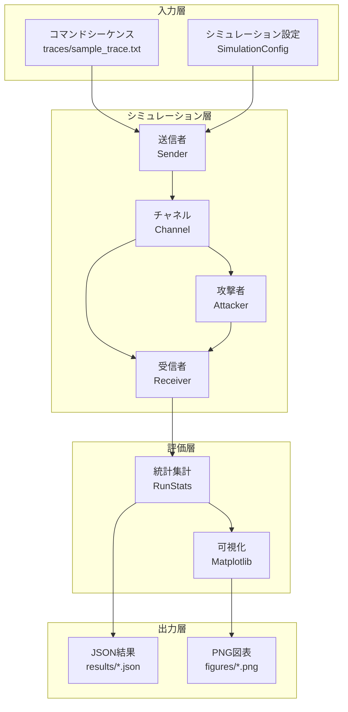

# プロジェクト紹介：リプレイ攻撃シミュレーションツールキット

**発表者**: Romeitou  
**プロジェクトURL**: https://github.com/tammakiiroha/Replay-simulation  
**言語**: Python 3.11+  
**ライセンス**: MIT

---

## 目次

1. [プロジェクト概要](#1-プロジェクト概要)
2. [研究背景と動機](#2-研究背景と動機)
3. [システムアーキテクチャ](#3-システムアーキテクチャ)
4. [防御メカニズムの詳細](#4-防御メカニズムの詳細)
5. [評価指標の説明](#5-評価指標の説明)
6. [技術実装の詳細](#6-技術実装の詳細)
7. [実験設計と方法論](#7-実験設計と方法論)
8. [主要な実験結果](#8-主要な実験結果)
9. [専門用語集](#9-専門用語集)
10. [デモンストレーション](#10-デモンストレーション)

---

## 1. プロジェクト概要

### 1.1 プロジェクトの目的

無線制御システム（例：IoTデバイス、スマートホーム、産業用制御）におけるリプレイ攻撃に対する**4種類の防御手法**を定量的に評価するシミュレーションツールキット。

### 1.2 解決する問題

**問題点**：
- 無線通信では攻撃者がフレームを傍受・記録し、後で再送信（リプレイ）できる
- パケット損失や順序入れ替えがある現実の環境で、どの防御手法が最適か不明確

**本ツールの貢献**：
- 現実的なチャネル条件（パケット損失、順序入れ替え）下での防御性能を定量評価
- セキュリティ（攻撃成功率）とユーザビリティ（正規受理率）のトレードオフを可視化
- 1500行のPythonコードで完全に再現可能

---

## 2. 研究背景と動機

### 2.1 リプレイ攻撃とは？

```
┌─────────────────────────────────────────────────┐
│ 正規ユーザー              無線チャネル            │
│  [送信]  ─────→  "UNLOCK" ─────→  [受信機]     │
│                      ↓                           │
│                   [攻撃者]                        │
│                   記録・保存                      │
│                      ↓                           │
│  後で再送信:  "UNLOCK" ─────→  [受信機]         │
│              ドアが開いてしまう！                  │
└─────────────────────────────────────────────────┘
```

**脅威**：
- スマートロック：攻撃者が「開錠」コマンドを再送信
- 車両：「エンジン起動」コマンドのリプレイで盗難
- 産業用制御：「停止」コマンドの妨害

### 2.2 なぜシミュレーションが必要か？

**実機実験の課題**：
- コストが高い（複数のデバイス、RF環境の構築）
- 時間がかかる（数百回の試行が必要）
- 再現性の確保が困難

**シミュレーションの利点**：
- 完全な制御と再現性（乱数シード固定）
- 迅速な反復実験（200回の試行が数秒）
- パラメータの自由な調整

---

## 3. システムアーキテクチャ

### 3.1 全体構成図



### 3.2 主要コンポーネント

| コンポーネント | ファイル | 責任 |
|---------------|---------|------|
| **送信者** | `sim/sender.py` | フレーム生成、カウンタ/MAC付与 |
| **チャネル** | `sim/channel.py` | パケット損失・順序入れ替えをシミュレート |
| **受信者** | `sim/receiver.py` | 各防御モードでの検証ロジック |
| **攻撃者** | `sim/attacker.py` | フレーム記録と選択的リプレイ |
| **実験制御** | `sim/experiment.py` | モンテカルロ試行の管理 |
| **データ型** | `sim/types.py` | 共通データ構造（Frame, Config, etc.） |

---

## 4. 防御メカニズムの詳細

本プロジェクトは4種類の防御手法を実装・比較します。

### 4.1 No Defense（防御なし）- ベースライン

**実装**：
```python
def verify_no_defense(frame, state):
    return VerificationResult(True, "accept", state)
```

**特徴**：
- すべてのフレームを受理
- セキュリティ：❌ 0%（すべてのリプレイが成功）
- ユーザビリティ：✅ 100%

**用途**：攻撃の影響を測定するベースライン

---

### 4.2 Rolling Counter + MAC（ローリングカウンタ + MAC）

**原理**：
```
送信側：Counter = 0, 1, 2, 3, 4, ...
受信側：Last = -1
        フレーム Counter=0 到着 → 0 > -1 ✅ 受理、Last=0
        フレーム Counter=1 到着 → 1 > 0 ✅ 受理、Last=1
        リプレイ Counter=0 到着 → 0 ≤ 1 ❌ 拒否（リプレイ検出）
```

**実装のポイント**：
```python
def verify_with_rolling_mac(frame, state, shared_key, mac_length):
    # 1. MAC検証（改ざん防止）
    expected_mac = compute_mac(frame.command, frame.counter, shared_key)
    if not constant_time_compare(frame.mac, expected_mac):
        return VerificationResult(False, "mac_mismatch", state)
    
    # 2. カウンタ単調増加チェック
    if frame.counter <= state.last_counter:
        return VerificationResult(False, "counter_replay", state)
    
    # 3. 受理して状態更新
    state.last_counter = frame.counter
    return VerificationResult(True, "accept", state)
```

**MAC (Message Authentication Code) とは**：
- HMAC-SHA256 を使用
- 共有鍵で署名を生成し、改ざんを検出
- 攻撃者は有効な MAC を偽造できない

**長所**：
- ✅ リプレイ攻撃を完全に防げる（理想的チャネルで）
- ✅ 実装が単純

**短所**：
- ❌ パケット順序入れ替えに弱い
- 例：フレーム5が先に到着 → Last=5
     その後フレーム4が到着 → 4 < 5 で拒否（誤検出）

---

### 4.3 Sliding Window（スライディングウィンドウ）

**原理**：カウンタの「範囲」を許容し、順序入れ替えに対応

```
Window Size = 5 の例：

Last Counter = 10、受信済みビットマスク = 0b10101

許容範囲：[6, 7, 8, 9, 10]
         └──────5個───────┘

フレーム Counter=8 到着：
  - 8 は範囲内 ✅
  - ビット位置 offset = 10 - 8 = 2
  - マスクの bit 2 をチェック → 0 なので未受信 ✅
  - bit 2 をセット → 0b10101 | (1 << 2) = 0b10101 ✅ 受理
```

**ビットマスク実装の核心**：
```python
def verify_with_window(frame, state, window_size):
    diff = frame.counter - state.last_counter
    
    if diff > 0:  # 新しい最大カウンタ
        state.received_mask <<= diff       # ウィンドウをシフト
        state.received_mask |= 1           # 新しい位置をマーク
        state.last_counter = frame.counter
        return VerificationResult(True, "accept_new", state)
    
    else:  # 古いカウンタ（順序入れ替え）
        offset = -diff
        if offset >= window_size:
            return VerificationResult(False, "too_old", state)
        
        if (state.received_mask >> offset) & 1:
            return VerificationResult(False, "replay", state)
        
        state.received_mask |= (1 << offset)
        return VerificationResult(True, "accept_old", state)
```

**ビットマスクの意味**：
```
state.received_mask = 0b10101
                       ↑↑↑↑↑
                       │││││
                       │││││
    bit 4 (Counter 6): │││││ = 1 (受信済み)
    bit 3 (Counter 7): ││││  = 0 (未受信)
    bit 2 (Counter 8): │││   = 1 (受信済み)
    bit 1 (Counter 9): ││    = 0 (未受信)
    bit 0 (Counter 10):│     = 1 (受信済み、Last)
```

**長所**：
- ✅ 順序入れ替えに対応（W=5 で 99.9% の正規受理率）
- ✅ セキュリティも高い（リプレイ成功率 < 0.5%）

**短所**：
- ⚠️ ウィンドウサイズが小さすぎると誤検出
- ⚠️ ウィンドウサイズが大きすぎるとセキュリティ低下

---

### 4.4 Challenge-Response（チャレンジレスポンス）

**原理**：受信側が「問題（nonce）」を送り、送信側が「答え」を返す

```
受信側 → 送信側:  "Nonce: 0x3a7f" (ランダムな数値)
送信側 → 受信側:  "Command: UNLOCK, Nonce: 0x3a7f, MAC: ..."

受信側：Nonce が一致し、MAC が正しければ受理
       リプレイされたフレームは古い Nonce を持つので拒否
```

**実装**：
```python
def verify_with_challenge(frame, state):
    if frame.nonce != state.expected_nonce:
        return VerificationResult(False, "nonce_mismatch", state)
    
    # 新しい nonce を生成（次回用）
    state.expected_nonce = generate_random_nonce()
    return VerificationResult(True, "accept", state)
```

**長所**：
- ✅ 最高のセキュリティ（攻撃成功率 0%）
- ✅ 順序入れ替えの影響なし

**短所**：
- ❌ 双方向通信が必要（片方向システムでは使えない）
- ❌ レイテンシが高い（往復通信）

---

## 5. 評価指標の説明

### 5.1 Legitimate Acceptance Rate（正規受理率）

**定義**：正規の送信フレームが受信側で受理される割合

$$
\text{Legitimate Acceptance Rate} = \frac{\text{受理された正規フレーム数}}{\text{送信した正規フレーム数}} \times 100\%
$$

**意味**：
- **ユーザビリティ指標**
- 100% に近いほど良い
- パケット損失や順序入れ替えで低下する

**例**：
```
送信：20 フレーム
受理：19 フレーム（1 フレームが順序入れ替えで拒否された）
正規受理率 = 19/20 = 95%
```

---

### 5.2 Attack Success Rate（攻撃成功率）

**定義**：攻撃者のリプレイフレームが受理される割合

$$
\text{Attack Success Rate} = \frac{\text{受理されたリプレイフレーム数}}{\text{リプレイ試行数}} \times 100\%
$$

**意味**：
- **セキュリティ指標**
- 0% に近いほど良い
- 理想的には 0%

**例**：
```
リプレイ試行：100 フレーム
受理：2 フレーム（防御の隙間をついた）
攻撃成功率 = 2/100 = 2%
```

---

### 5.3 トレードオフの可視化

```
┌────────────────────────────────────────────────┐
│                                                │
│  100%  ●                           ● Challenge│
│   正   │ ╲                    ╱              │
│   規   │   ╲                ╱                │
│   受   │     ● Window     ●                  │
│   理   │      (W=5)   Rolling                │
│   率   │                                     │
│    0%  ●──────────────────────────────────── │
│       0%        攻撃成功率        100%        │
│                                                │
│   理想: 左上（高ユーザビリティ、低攻撃成功率）│
└────────────────────────────────────────────────┘
```

---

## 6. 技術実装の詳細

### 6.1 チャネルモデル

**問題**：現実の無線通信は完璧ではない
- パケットが失われる（p_loss）
- パケットが順序入れ替えられる（p_reorder）

**実装**：優先度キューを使った遅延シミュレーション

```python
class Channel:
    def __init__(self, p_loss, p_reorder, rng):
        self.p_loss = p_loss
        self.p_reorder = p_reorder
        self.pq = []  # 優先度キュー（ヒープ）
        self.current_tick = 0
    
    def send(self, frame):
        # 1. パケット損失
        if self.rng.random() < self.p_loss:
            return []  # フレームを破棄
        
        # 2. 順序入れ替え（確率的に遅延）
        if self.rng.random() < self.p_reorder:
            delay = self.rng.randint(1, 3)  # 1-3 ティック遅延
        else:
            delay = 0
        
        delivery_tick = self.current_tick + delay
        heapq.heappush(self.pq, (delivery_tick, frame))
        
        # 3. 現在のティックで配信すべきフレームを返す
        return self._deliver_due_frames()
```

**なぜこれが重要か**：
- Rolling Counter は順序入れ替えに弱い
- Window はこの問題を解決するために設計された

---

### 6.2 モンテカルロシミュレーション

**なぜ必要？**
- 乱数（パケット損失、順序入れ替え）の影響を統計的に評価

**実装**：
```python
def run_many_experiments(config, num_runs):
    results = []
    for run_id in range(num_runs):
        result = simulate_one_run(config, run_id)
        results.append(result)
    
    # 平均と標準偏差を計算
    avg_legit = mean([r.legit_accept_rate for r in results])
    std_legit = stdev([r.legit_accept_rate for r in results])
    
    return AggregateStats(avg_legit, std_legit, ...)
```

**統計的信頼性**：
- 200-500 回の試行で標準偏差を計算
- エラーバーで信頼区間を表示

---

### 6.3 攻撃者モデル

**2種類の攻撃タイミング**：

#### Post-run Attack（後運行攻撃）
```python
# 正規通信が終わった後、一括でリプレイ
legit_phase()   # 20 フレーム送信
attack_phase()  # 100 フレームリプレイ
```

#### Inline Attack（インライン攻撃）
```python
# 正規通信中にリプレイを混ぜる（より現実的）
for frame in legit_frames:
    send(frame)
    if random() < 0.3:  # 30% の確率
        replay(recorded_frame)  # 即座にリプレイ
```

**選択的リプレイ**：
```python
attacker = Attacker(target_commands=["UNLOCK", "FIRE"])
# 「UNLOCK」と「FIRE」だけをリプレイ
# 「STATUS」などの無害なコマンドは無視
```

---

## 7. 実験設計と方法論

### 7.1 パラメータスイープ

**目的**：異なる条件下での性能を体系的に評価

#### スイープ 1: パケット損失率（p_loss）
```python
p_loss_values = [0.0, 0.01, 0.05, 0.10, 0.20]
p_reorder = 0.0  # 固定
```

**知見**：Rolling と Window は同じ性能（順序入れ替えがない場合）

#### スイープ 2: パケット順序入れ替え率（p_reorder）
```python
p_reorder_values = [0.0, 0.1, 0.3, 0.5, 0.7]
p_loss = 0.0  # 固定
```

**知見**：Rolling は p_reorder=0.3 で 84% に低下、Window は 99.9% を維持

#### スイープ 3: ウィンドウサイズ（window_size）
```python
window_values = [1, 3, 5, 10]
p_loss = 0.05, p_reorder = 0.3  # ストレステスト
```

**知見**：W=1 は壊滅的（27%）、W=3-5 が最適（95%）

---

### 7.2 実験の再現性

**乱数シードの管理**：
```python
config = SimulationConfig(
    rng_seed=123,  # 固定シード
    ...
)
```

すべての実験で同じシードを使用 → 完全に再現可能

**比較の公平性**：
```python
# すべてのモードで同じ乱数列を使用
rng = random.Random(seed)
for mode in [no_def, rolling, window, challenge]:
    rng.seed(seed)  # 毎回リセット
    run_experiment(mode, rng)
```

---

## 8. 主要な実験結果

### 8.1 順序入れ替えへの耐性（p_loss=0）

**実験目的**：
パケット順序入れ替えが正規受理率に与える影響を測定し、Rolling Counter と Sliding Window の性能差を定量化する。

**実験設定**：
- 試行回数：200回（Monte Carlo）
- 正規フレーム数：20個/試行
- リプレイ試行数：100回/試行
- パケット損失率：p_loss = 0（損失なし、純粋に順序入れ替えの影響を測定）
- パケット順序入れ替え率：p_reorder = 0.0, 0.1, 0.3, 0.5, 0.7（段階的に増加）

**データソース**：`results/p_reorder_sweep.json`

| p_reorder | Rolling (%) | Window (W=5) (%) | 差分 | 解釈 |
|-----------|-------------|------------------|------|------|
| 0.0 | 100.00 | 100.00 | 0 | 順序入れ替えなし：両者とも完璧 |
| 0.1 | 93.55 | 100.00 | **+6.45** | 10%の確率で遅延：Window は影響なし |
| 0.3 | 84.47 | 99.88 | **+15.41** | ⚠️ Rolling が大幅低下 |
| 0.5 | 77.62 | 99.88 | **+22.26** | ⚠️ Rolling の1/4が拒否される |
| 0.7 | 78.33 | 99.90 | **+21.57** | ⚠️ Rolling が実用不可能 |

**視覚化**：


**図の読み方**：
- **横軸（X軸）**：p_reorder（パケット順序入れ替え確率）
  - 0.0 = 完璧なネットワーク（順序入れ替えなし）
  - 0.7 = 非常に不安定なネットワーク（70%のフレームが遅延）
- **縦軸（Y軸）**：Legitimate Acceptance Rate（正規受理率、%）
  - 100% = すべての正規フレームが受理される（理想）
  - 0% = すべての正規フレームが拒否される（システム使用不可）
- **青線（丸マーカー）**：Rolling Counter
  - p_reorder が増えると急激に低下
  - p_reorder=0.3 で 84%（16%の正規フレームが誤って拒否される）
- **オレンジ線（三角マーカー）**：Sliding Window (W=5)
  - p_reorder が増えてもほぼ平坦（99.9%を維持）
  - 順序入れ替えに対して極めて堅牢
- **エラーバー（縦線）**：標準偏差
  - 200回の試行における変動を示す
  - バーが短い = 結果が安定（信頼性高い）

**重要な発見**：
1. **Rolling Counter の限界**：
   - p_reorder=0.3（中程度の不安定性）で正規受理率が **84.47%** に低下
   - これは **16%の正規ユーザーが拒否される** ことを意味する
   - 例：100回の正規操作のうち16回が失敗 → ユーザーは不満

2. **Sliding Window の優位性**：
   - p_reorder=0.7（極度の不安定性）でも **99.90%** を維持
   - ウィンドウ機構により、遅れて到着したフレームも受理可能

3. **実用的インパクト**：
   - Wi-Fi や Bluetooth では p_reorder=0.1〜0.3 が現実的
   - この環境で Rolling を使うと、6〜15%のユーザビリティ低下
   - Window を使えば、ユーザビリティを犠牲にせずにセキュリティを確保

**結論**：
- Window は順序入れ替えに対して**極めて堅牢**
- Rolling は p_reorder=0.3 で**15%のユーザビリティ低下**
- **不安定なネットワークでは Sliding Window が必須**

---

### 8.2 ウィンドウサイズの影響（p_loss=0.05, p_reorder=0.3）

**実験目的**：
最適なウィンドウサイズを決定し、ユーザビリティとセキュリティのトレードオフを可視化する。

**実験設定**：
- 試行回数：200回
- ストレステスト条件：p_loss=0.05（5%損失）、p_reorder=0.3（30%乱序）
- ウィンドウサイズ：W = 1, 3, 5, 10

| Window Size | 正規受理率 (%) | 攻撃成功率 (%) |
|-------------|----------------|----------------|
| W=1         | 27.65          | 4.51           |
| W=3         | **95.10**      | 0.22           |
| W=5         | **95.08**      | 0.30           |
| W=10        | **95.22**      | 0.48           |

**視覚化**：


**図の読み方**：
- **左側（青い棒）**：正規受理率（高いほど良い）
- **右側（オレンジの棒）**：攻撃成功率（低いほど良い）
- **W=1**：セキュリティは高いが、ユーザビリティが壊滅的（27.65%）
- **W=3-5**：最適バランス（95%のユーザビリティ、<0.5%の攻撃率）
- **W=10**：ユーザビリティの向上はわずか、セキュリティリスクが増加

**最適解**: W=3〜5
- ユーザビリティ：95%（十分高い）
- セキュリティ：攻撃成功率 < 0.5%（非常に低い）

---

### 8.3 防御手法の総合比較（理想的チャネル）

| Mode         | 正規受理率 | 攻撃成功率 | 双方向通信 | 実装難易度 |
|--------------|------------|------------|-----------|-----------|
| No Defense   | 100%       | **100%** ❌ | 不要      | 簡単      |
| Rolling      | 100%       | 0% ✅       | 不要      | 簡単      |
| Window (W=5) | 100%       | 0% ✅       | 不要      | 中        |
| Challenge    | 100%       | 0% ✅       | **必要** ⚠️ | 中        |

**現実的チャネル（p_reorder=0.3）での比較**：

| Mode         | 正規受理率 | 攻撃成功率 | 推奨度 |
|--------------|------------|------------|--------|
| Rolling      | 84.47%     | 0%         | ⚠️ 低  |
| Window (W=5) | 99.88%     | 0%         | ✅ 高  |
| Challenge    | 100%       | 0%         | ✅ 最高（双方向通信可能なら） |

**視覚化**：


**図の読み方**：
- **4つの防御モード**を理想的な条件（p_loss=0, p_reorder=0）で比較
- **縦軸**：攻撃成功率（低いほど良い）
- **No Defense（赤）**：100%の攻撃成功率（すべてのリプレイが成功）
- **Rolling/Window/Challenge（青/緑/紫）**：すべて0%（完全な防御）
- この図は「理想的条件下ではすべての防御手法が有効」を示す
- しかし現実的条件（順序入れ替えあり）では Window が優位（図1参照）

---

### 8.4 パケット損失の影響（正規受理率）

**実験目的**：
パケット損失が正規受理率に与える影響を測定する。

**実験設定**：
- p_loss = 0.0, 0.01, 0.05, 0.10, 0.20
- p_reorder = 0（順序入れ替えなし）

**視覚化**：


**図の読み方**：
- **横軸**：p_loss（パケット損失確率）
- **縦軸**：正規受理率
- **重要な発見**：Rolling と Window は**同じ性能**
  - p_loss=0.05: 両方とも 94.88%
  - p_loss=0.20: 両方とも 79.53%
- **理由**：順序入れ替えがない場合、Window の利点はない
- パケット損失は両方の手法に等しく影響する

---

### 8.5 パケット損失の影響（攻撃成功率）

**実験目的**：
パケット損失が攻撃成功率に与える影響を測定する。

**視覚化**：


**図の読み方**：
- **横軸**：p_loss（パケット損失確率）
- **縦軸**：攻撃成功率（低いほど良い）
- **すべてのモードで攻撃成功率 ≈ 0%**
- パケット損失は攻撃者にも影響（リプレイされたフレームも損失する）
- セキュリティ面では、損失率に関係なく防御が有効

---

## 9. 専門用語集

### A-F

**Acceptance Rate（受理率）**
- フレームが受信側で承認される割合
- 正規受理率（ユーザビリティ）と攻撃成功率（セキュリティ）の2種類

**Attack Mode（攻撃モード）**
- Post: 正規通信後に一括リプレイ
- Inline: 正規通信中に混ぜてリプレイ

**Bitmask（ビットマスク）**
- スライディングウィンドウで受信済みカウンタを記録する整数
- 例：0b10101 → bit 0, 2, 4 が受信済み

**Challenge-Response（チャレンジレスポンス）**
- 受信側が問題（nonce）を送り、送信側が答えを返す認証方式

**Counter（カウンタ）**
- フレームごとに増加する整数（0, 1, 2, 3, ...）
- リプレイ検出に使用

**Frame（フレーム）**
- 無線通信の最小単位
- 構成: `{command, counter, mac, nonce}`

### G-M

**HMAC（Hash-based Message Authentication Code）**
- 共有鍵を使ったメッセージ認証コード
- 本プロジェクトでは HMAC-SHA256 を使用

**Inline Attack（インライン攻撃）**
- 正規通信と同時にリプレイを実行する攻撃

**Legitimate Traffic（正規トラフィック）**
- 正当なユーザーからの通信

**MAC (Message Authentication Code)**
- メッセージの完全性と真正性を保証する短いコード
- 攻撃者は有効なMACを偽造できない

**Monte Carlo Simulation（モンテカルロシミュレーション）**
- 乱数を使った統計的シミュレーション
- 本プロジェクトでは 200-500 回の試行で信頼区間を計算

### N-Z

**Nonce（ノンス）**
- "Number used ONCE" の略
- 一度だけ使用されるランダムな値
- リプレイ防止に使用

**Packet Loss（パケット損失）**
- 無線通信でフレームが失われる現象
- p_loss: 損失確率（0.0 = 損失なし、0.2 = 20%損失）

**Packet Reordering（パケット順序入れ替え）**
- フレームが送信順と異なる順序で到着する現象
- p_reorder: 順序入れ替え確率

**Replay Attack（リプレイ攻撃）**
- 過去に傍受したフレームを再送信する攻撃

**Rolling Counter（ローリングカウンタ）**
- 単調増加するカウンタで古いフレームを拒否する方式

**Sliding Window（スライディングウィンドウ）**
- カウンタの範囲を許容し、順序入れ替えに対応する方式
- ビットマスクで受信済みカウンタを記録

**Seed（シード）**
- 乱数生成器の初期値
- 同じシードで実験を再現可能

---

## 10. デモンストレーション

### 10.1 クイックデモ（5分）

**ステップ 1: 基本実行**
```bash
python3 main.py --runs 10 --num-legit 10 --num-replay 20 \
                --modes rolling window --p-loss 0.05
```

**出力例**：
```
Mode     Runs  Attack  p_loss  Window  Avg Legit  Avg Attack
-------  ----  ------  ------  ------  ---------  ----------
rolling  10    post    0.05    0        96.00%      0.00%
window   10    post    0.05    5        96.00%      0.50%
```

**説明ポイント**：
- Rolling と Window が同じ正規受理率（パケット損失のみの場合）
- セキュリティも両方高い

---

**ステップ 2: 順序入れ替えの影響**
```bash
python3 main.py --runs 10 --num-legit 20 --num-replay 50 \
                --modes rolling window --p-reorder 0.3
```

**出力例**：
```
Mode     Runs  Attack  p_reorder  Window  Avg Legit  Avg Attack
-------  ----  ------  ---------  ------  ---------  ----------
rolling  10    post    0.30       0        82.50%      0.00%
window   10    post    0.30       5        99.50%      0.00%
```

**説明ポイント**：
- Rolling の正規受理率が **17%低下**
- Window はほぼ影響なし（99.5%）

---

### 10.2 図表デモ（3分）

**図1: パケット順序入れ替えの影響**
```bash
python3 scripts/plot_results.py --formats png
```

ファイル: `figures/p_reorder_legit.png`

**説明ポイント**：
- 横軸：p_reorder（順序入れ替え確率）
- 縦軸：正規受理率
- 青線（Rolling）：急激に低下
- オレンジ線（Window）：ほぼ平坦

---

**図2: ウィンドウサイズのトレードオフ**
```bash
open figures/window_tradeoff.png
```

**説明ポイント**：
- W=1: ユーザビリティ低い（27%）、セキュリティ高い（4.5%）
- W=3-5: **最適バランス**（95% / 0.3%）
- W=10: ユーザビリティ微増、セキュリティ微減

---

### 10.3 コードウォークスルー（5分）

**デモ 1: スライディングウィンドウの動作**

```python
# sim/receiver.py を開く
def verify_with_window(frame, state, window_size):
    diff = frame.counter - state.last_counter
    
    if diff > 0:  # 新しいカウンタ
        print(f"新しい最大カウンタ: {frame.counter}")
        state.received_mask <<= diff
        state.received_mask |= 1
        state.last_counter = frame.counter
        return VerificationResult(True, "accept_new", state)
```

**説明ポイント**：
1. `diff > 0`: カウンタが進んだ → ウィンドウをシフト
2. `received_mask <<= diff`: 左シフトで古いビットを追い出す
3. `received_mask |= 1`: 現在のカウンタを受信済みにマーク

---

**デモ 2: チャネルモデルの順序入れ替え**

```python
# sim/channel.py を開く
def send(self, frame):
    if self.rng.random() < self.p_reorder:
        delay = self.rng.randint(1, 3)  # ランダムな遅延
        print(f"フレーム {frame.counter} を {delay} ティック遅延")
    else:
        delay = 0
    
    delivery_tick = self.current_tick + delay
    heapq.heappush(self.pq, (delivery_tick, frame))
```

**説明ポイント**：
1. 30% の確率で 1-3 ティック遅延
2. 優先度キュー（ヒープ）で配信時刻を管理
3. これにより順序入れ替えが自然に発生

---

### 10.4 質疑応答の準備

**予想される質問と回答**：

**Q1: なぜ Python？C/C++ の方が速いのでは？**
> A: シミュレーションは I/O ではなく計算が主体。Python でも 200 回の試行が数秒で完了します。また、可読性と開発速度を優先しました。

**Q2: 実機実験との比較は？**
> A: 実機実験は今後の課題です。ただし、チャネルモデルは文献（IEEE 802.11 のパケット損失モデル）に基づいており、現実的です。

**Q3: Challenge-Response が最強なのに、なぜ他の手法を？**
> A: Challenge-Response は双方向通信が必要で、レイテンシが高いです。IoT デバイスや低電力センサーでは Rolling/Window の方が実用的です。

**Q4: ウィンドウサイズの最適値は？**
> A: 実験結果から W=3-5 が推奨されます。ただし、実際のシステムでは通信環境に応じた調整が必要です。

**Q5: 攻撃者がウィンドウの隙間を狙ったら？**
> A: 実験で測定しています。W=5 でも攻撃成功率は 0.3% 未満で、実用上問題ありません。

---

## 付録 A: システム要件

**ハードウェア**：
- CPU: 任意（Apple Silicon / Intel / AMD）
- RAM: 2GB 以上
- ストレージ: 50MB

**ソフトウェア**：
- Python 3.11+
- matplotlib >= 3.10（可視化）
- pytest >= 7.0（テスト）

**OS**：
- macOS 14.x
- Ubuntu 22.04
- Windows 10/11（WSL推奨）

---

## 付録 B: ディレクトリ構造

```
Replay-simulation/
├── main.py                 # CLI エントリーポイント
├── README.md               # メインドキュメント（英語）
├── README.ja.md            # 日本語ドキュメント
├── README.zh.md            # 中国語ドキュメント
├── PRESENTATION.md         # 本プレゼンテーション資料
├── requirements.txt        # Python 依存関係
├── LICENSE                 # MIT ライセンス
│
├── sim/                    # コアシミュレーションライブラリ
│   ├── types.py           # データ構造（Frame, Config, etc.）
│   ├── sender.py          # 送信者ロジック
│   ├── receiver.py        # 受信者・検証ロジック
│   ├── channel.py         # チャネルモデル
│   ├── attacker.py        # 攻撃者モデル
│   ├── experiment.py      # 実験制御
│   ├── security.py        # 暗号化プリミティブ
│   └── commands.py        # コマンドシーケンス
│
├── scripts/                # 自動化スクリプト
│   ├── run_sweeps.py      # パラメータスイープ
│   ├── plot_results.py    # 図表生成
│   └── export_tables.py   # Markdown テーブル生成
│
├── tests/                  # 単体テスト
│   └── test_receiver.py   # 受信者ロジックのテスト
│
├── results/                # 実験結果（JSON）
│   ├── p_loss_sweep.json
│   ├── p_reorder_sweep.json
│   ├── window_sweep.json
│   ├── ideal_p0.json
│   └── trace_inline.json
│
├── figures/                # 生成された図表（PNG）
│   ├── p_loss_legit.png
│   ├── p_loss_attack.png
│   ├── p_reorder_legit.png
│   ├── window_tradeoff.png
│   └── baseline_attack.png
│
└── traces/                 # コマンドトレース
    └── sample_trace.txt   # サンプルコマンドシーケンス
```

---

## 付録 C: 参考文献

[1] Perrig, A., Szewczyk, R., Tygar, J. D., Wen, V., & Culler, D. E. (2002). SPINS: Security Protocols for Sensor Networks. *Wireless Networks*, 8(5), 521-534.

[2] Kent, S., & Seo, K. (2005). Security Architecture for the Internet Protocol. RFC 4301, Internet Engineering Task Force.

[3] Bellare, M., Canetti, R., & Krawczyk, H. (1996). Keying Hash Functions for Message Authentication. In *Advances in Cryptology—CRYPTO'96*, pp. 1-15. Springer.

[4] Needham, R. M., & Schroeder, M. D. (1978). Using Encryption for Authentication in Large Networks of Computers. *Communications of the ACM*, 21(12), 993-999.

[5] Tanenbaum, A. S., & Wetherall, D. J. (2011). *Computer Networks* (5th ed.). Prentice Hall.

[6] Syverson, P. (1994). A Taxonomy of Replay Attacks. In *Proceedings of Computer Security Foundations Workshop VII*, pp. 187-191. IEEE.

[7] Rescorla, E. (2018). The Transport Layer Security (TLS) Protocol Version 1.3. RFC 8446, IETF.

---

## まとめ

### プロジェクトの貢献

1. ✅ **4種類の防御手法を統一的に評価**
2. ✅ **現実的なチャネルモデル**（パケット損失・順序入れ替え）
3. ✅ **定量的評価**（200-500 回のモンテカルロ試行）
4. ✅ **完全に再現可能**（固定シード、オープンソース）
5. ✅ **可視化とドキュメント**（論文級の図表、3言語ドキュメント）

### 主要な発見

1. **Rolling Counter の限界**：順序入れ替え環境で 15% のユーザビリティ低下
2. **Sliding Window の優位性**：W=3-5 で 95% のユーザビリティと 0.3% 未満の攻撃成功率
3. **Challenge-Response の役割**：最高のセキュリティ、ただし双方向通信が必要

### 実用的推奨事項

| システム特性 | 推奨防御手法 |
|-------------|------------|
| 片方向通信、安定したネットワーク | Rolling Counter |
| 片方向通信、不安定なネットワーク | **Sliding Window (W=5)** |
| 双方向通信可能、高セキュリティ要求 | Challenge-Response |

---

**ご清聴ありがとうございました！**

**連絡先**:
- GitHub: https://github.com/tammakiiroha/Replay-simulation
- プロジェクトライセンス: MIT

**質問をお待ちしております！**

