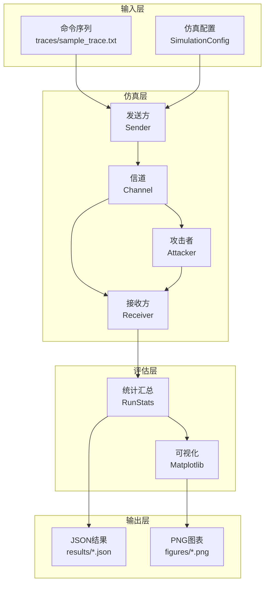

# 项目演示：重放攻击仿真工具包

**演示者**: Romeitou  
**项目地址**: https://github.com/tammakiiroha/Replay-simulation  
**编程语言**: Python 3.11+  
**许可证**: MIT

---

## 目录

1. [项目概述](#1-项目概述)
2. [研究背景与动机](#2-研究背景与动机)
3. [系统架构](#3-系统架构)
4. [防御机制详解](#4-防御机制详解)
5. [评估指标说明](#5-评估指标说明)
6. [技术实现细节](#6-技术实现细节)
7. [实验设计与方法论](#7-实验设计与方法论)
8. [主要实验结果](#8-主要实验结果)
9. [术语表](#9-术语表)
10. [演示说明](#10-演示说明)

---

## 1. 项目概述

### 1.1 项目目的

对无线控制系统（例如：IoT设备、智能家居、工业控制）中针对重放攻击的**4种防御机制**进行定量评估的仿真工具包。

### 1.2 解决的问题

**挑战**：
- 在无线通信中，攻击者可以截获并记录帧，然后稍后重新传输（重放）
- 在存在丢包和乱序的现实环境下，不清楚哪种防御机制是最优的

**本工具的贡献**：
- 在真实信道条件（丢包、乱序）下对防御性能进行定量评估
- 可视化安全性（攻击成功率）与可用性（合法接受率）的权衡
- 使用1500行Python代码实现完全可重现

---

## 2. 研究背景与动机

### 2.1 什么是重放攻击？

```
┌─────────────────────────────────────────────────┐
│ 合法用户              无线信道                    │
│  [发送方]  ─────→  "UNLOCK" ─────→  [接收方]    │
│                      ↓                           │
│                   [攻击者]                        │
│                   记录并保存                      │
│                      ↓                           │
│  稍后重放:  "UNLOCK" ─────→  [接收方]            │
│              门被打开了！                         │
└─────────────────────────────────────────────────┘
```

**威胁**：
- 智能锁：攻击者重放"解锁"命令
- 车辆：重放"启动引擎"命令进行盗窃
- 工业控制：干扰"停止"命令

### 2.2 为什么需要仿真？

**物理实验的挑战**：
- 成本高（多个设备、RF环境搭建）
- 耗时长（需要数百次试验）
- 难以确保可重现性

**仿真的优势**：
- 完全的控制和可重现性（固定随机种子）
- 快速迭代实验（200次试验仅需数秒）
- 自由调整参数

---

## 3. 系统架构

### 3.1 整体架构图



### 3.2 主要组件

| 组件 | 文件 | 职责 |
|------|------|------|
| **发送方** | `sim/sender.py` | 帧生成、计数器/MAC附加 |
| **信道** | `sim/channel.py` | 模拟丢包和乱序 |
| **接收方** | `sim/receiver.py` | 各防御模式的验证逻辑 |
| **攻击者** | `sim/attacker.py` | 帧记录和选择性重放 |
| **实验控制** | `sim/experiment.py` | 蒙特卡洛试验管理 |
| **数据类型** | `sim/types.py` | 公共数据结构（Frame、Config等） |

---

## 4. 防御机制详解

本项目实现并比较了4种防御机制。

### 4.1 无防御 - 基线

**实现**：
```python
def verify_no_defense(frame, state):
    return VerificationResult(True, "accept", state)
```

**特点**：
- 接受所有帧
- 安全性：❌ 0%（所有重放都成功）
- 可用性：✅ 100%

**用途**：衡量攻击影响的基线

---

### 4.2 滚动计数器 + MAC

**原理**：
```
发送方：Counter = 0, 1, 2, 3, 4, ...
接收方：Last = -1
        帧 Counter=0 到达 → 0 > -1 ✅ 接受，Last=0
        帧 Counter=1 到达 → 1 > 0 ✅ 接受，Last=1
        重放 Counter=0 到达 → 0 ≤ 1 ❌ 拒绝（检测到重放）
```

**实现要点**：
```python
def verify_with_rolling_mac(frame, state, shared_key, mac_length):
    # 1. MAC验证（防止篡改）
    expected_mac = compute_mac(frame.command, frame.counter, shared_key)
    if not constant_time_compare(frame.mac, expected_mac):
        return VerificationResult(False, "mac_mismatch", state)
    
    # 2. 计数器单调递增检查
    if frame.counter <= state.last_counter:
        return VerificationResult(False, "counter_replay", state)
    
    # 3. 接受并更新状态
    state.last_counter = frame.counter
    return VerificationResult(True, "accept", state)
```

**什么是MAC（消息认证码）**：
- 使用HMAC-SHA256
- 使用共享密钥生成签名以检测篡改
- 攻击者无法伪造有效的MAC

**优点**：
- ✅ 完全防止重放攻击（在理想信道下）
- ✅ 实现简单

**缺点**：
- ❌ 对包乱序脆弱
- 例如：帧5先到达 → Last=5
     然后帧4到达 → 4 < 5 被拒绝（误判）

---

### 4.3 滑动窗口

**原理**：允许计数器的"范围"以处理乱序

```
窗口大小 = 5 的例子：

最后计数器 = 10，已接收位掩码 = 0b10101

可接受范围：[6, 7, 8, 9, 10]
         └────5个项────┘

帧 Counter=8 到达：
  - 8 在范围内 ✅
  - 位位置 offset = 10 - 8 = 2
  - 检查掩码的位2 → 0 表示未接收 ✅
  - 设置位2 → 0b10101 | (1 << 2) = 0b10101 ✅ 接受
```

**核心位掩码实现**：
```python
def verify_with_window(frame, state, window_size):
    diff = frame.counter - state.last_counter
    
    if diff > 0:  # 新的最大计数器
        state.received_mask <<= diff       # 移动窗口
        state.received_mask |= 1           # 标记新位置
        state.last_counter = frame.counter
        return VerificationResult(True, "accept_new", state)
    
    else:  # 旧计数器（乱序）
        offset = -diff
        if offset >= window_size:
            return VerificationResult(False, "too_old", state)
        
        if (state.received_mask >> offset) & 1:
            return VerificationResult(False, "replay", state)
        
        state.received_mask |= (1 << offset)
        return VerificationResult(True, "accept_old", state)
```

**位掩码的含义**：
```
state.received_mask = 0b10101
                       ↑↑↑↑↑
                       │││││
                       │││││
    位4 (Counter 6):   │││││ = 1 (已接收)
    位3 (Counter 7):   ││││  = 0 (未接收)
    位2 (Counter 8):   │││   = 1 (已接收)
    位1 (Counter 9):   ││    = 0 (未接收)
    位0 (Counter 10):  │     = 1 (已接收，Last)
```

**优点**：
- ✅ 处理乱序（W=5时99.9%的合法接受率）
- ✅ 高安全性（重放成功率 < 0.5%）

**缺点**：
- ⚠️ 窗口太小会导致误判
- ⚠️ 窗口太大会降低安全性

---

### 4.4 挑战-响应

**原理**：接收方发送"挑战（nonce）"，发送方返回"响应"

```
接收方 → 发送方：  "Nonce: 0x3a7f"（随机值）
发送方 → 接收方：  "Command: UNLOCK, Nonce: 0x3a7f, MAC: ..."

接收方：如果nonce匹配且MAC正确则接受
       重放的帧具有旧nonce，会被拒绝
```

**实现**：
```python
def verify_with_challenge(frame, state):
    if frame.nonce != state.expected_nonce:
        return VerificationResult(False, "nonce_mismatch", state)
    
    # 生成新nonce（供下次使用）
    state.expected_nonce = generate_random_nonce()
    return VerificationResult(True, "accept", state)
```

**优点**：
- ✅ 最高安全性（0%攻击成功率）
- ✅ 不受乱序影响

**缺点**：
- ❌ 需要双向通信（单向系统无法使用）
- ❌ 高延迟（往返通信）

---

## 5. 评估指标说明

### 5.1 合法接受率

**定义**：接收方接受的合法发送帧的比例

$$
\text{合法接受率} = \frac{\text{接受的合法帧数}}{\text{发送的合法帧数}} \times 100\%
$$

**含义**：
- **可用性指标**
- 越高越好（接近100%）
- 因丢包和乱序而降低

**示例**：
```
发送：20帧
接受：19帧（1帧因乱序被拒绝）
合法接受率 = 19/20 = 95%
```

---

### 5.2 攻击成功率

**定义**：攻击者的重放帧被接受的比例

$$
\text{攻击成功率} = \frac{\text{接受的重放帧数}}{\text{重放尝试数}} \times 100\%
$$

**含义**：
- **安全性指标**
- 越低越好（接近0%）
- 理想情况为0%

**示例**：
```
重放尝试：100帧
接受：2帧（利用了防御漏洞）
攻击成功率 = 2/100 = 2%
```

---

### 5.3 权衡可视化

```
┌────────────────────────────────────────────────┐
│                                                │
│  100%  ●                           ● Challenge│
│   合   │ ╲                    ╱              │
│   法   │   ╲                ╱                │
│   接   │     ● Window     ●                  │
│   受   │      (W=5)   Rolling                │
│   率   │                                     │
│    0%  ●──────────────────────────────────── │
│       0%        攻击成功率        100%        │
│                                                │
│   理想：左上角（高可用性、低攻击成功率）       │
└────────────────────────────────────────────────┘
```

---

## 6. 技术实现细节

### 6.1 信道模型

**问题**：真实的无线通信并不完美
- 包会丢失（p_loss）
- 包会乱序（p_reorder）

**实现**：使用优先队列进行延迟仿真

```python
class Channel:
    def __init__(self, p_loss, p_reorder, rng):
        self.p_loss = p_loss
        self.p_reorder = p_reorder
        self.pq = []  # 优先队列（堆）
        self.current_tick = 0
    
    def send(self, frame):
        # 1. 丢包
        if self.rng.random() < self.p_loss:
            return []  # 丢弃帧
        
        # 2. 乱序（概率性延迟）
        if self.rng.random() < self.p_reorder:
            delay = self.rng.randint(1, 3)  # 1-3个时间片延迟
        else:
            delay = 0
        
        delivery_tick = self.current_tick + delay
        heapq.heappush(self.pq, (delivery_tick, frame))
        
        # 3. 返回当前时间片应交付的帧
        return self._deliver_due_frames()
```

**为什么这很重要**：
- 滚动计数器对乱序脆弱
- 滑动窗口正是为解决这个问题而设计的

---

### 6.2 蒙特卡洛仿真

**为什么需要？**
- 统计评估随机效应（丢包、乱序）的影响

**实现**：
```python
def run_many_experiments(config, num_runs):
    results = []
    for run_id in range(num_runs):
        result = simulate_one_run(config, run_id)
        results.append(result)
    
    # 计算均值和标准差
    avg_legit = mean([r.legit_accept_rate for r in results])
    std_legit = stdev([r.legit_accept_rate for r in results])
    
    return AggregateStats(avg_legit, std_legit, ...)
```

**统计可靠性**：
- 200-500次试验以计算标准差
- 误差棒显示置信区间

---

### 6.3 攻击者模型

**2种攻击时机**：

#### 事后攻击（Post-run Attack）
```python
# 合法通信结束后批量重放
legit_phase()   # 发送20帧
attack_phase()  # 重放100帧
```

#### 内联攻击（Inline Attack）
```python
# 在合法通信期间混入重放（更真实）
for frame in legit_frames:
    send(frame)
    if random() < 0.3:  # 30%概率
        replay(recorded_frame)  # 立即重放
```

**选择性重放**：
```python
attacker = Attacker(target_commands=["UNLOCK", "FIRE"])
# 只重放"UNLOCK"和"FIRE"
# 忽略无害命令如"STATUS"
```

---

## 7. 实验设计与方法论

### 7.1 参数扫描

**目的**：系统性地评估不同条件下的性能

#### 扫描1：丢包率（p_loss）
```python
p_loss_values = [0.0, 0.01, 0.05, 0.10, 0.20]
p_reorder = 0.0  # 固定
```

**发现**：滚动计数器和窗口性能相同（无乱序时）

#### 扫描2：包乱序率（p_reorder）
```python
p_reorder_values = [0.0, 0.1, 0.3, 0.5, 0.7]
p_loss = 0.0  # 固定
```

**发现**：滚动计数器在p_reorder=0.3时降至84%，窗口保持99.9%

#### 扫描3：窗口大小（window_size）
```python
window_values = [1, 3, 5, 10]
p_loss = 0.05, p_reorder = 0.3  # 压力测试
```

**发现**：W=1灾难性（27%），W=3-5最优（95%）

---

### 7.2 实验可重现性

**随机种子管理**：
```python
config = SimulationConfig(
    rng_seed=123,  # 固定种子
    ...
)
```

所有实验使用相同种子 → 完全可重现

**公平比较**：
```python
# 所有模式使用相同的随机序列
rng = random.Random(seed)
for mode in [no_def, rolling, window, challenge]:
    rng.seed(seed)  # 每次重置
    run_experiment(mode, rng)
```

---

## 8. 主要实验结果

### 8.1 抗乱序能力（p_loss=0）

**实验目的**：
测量包乱序对合法接受率的影响，量化滚动计数器和滑动窗口之间的性能差异。

**实验设置**：
- 试验次数：200次（蒙特卡洛）
- 每次试验的合法帧数：20
- 每次试验的重放尝试数：100
- 丢包率：p_loss = 0（无丢包，纯粹测量乱序影响）
- 包乱序率：p_reorder = 0.0, 0.1, 0.3, 0.5, 0.7（逐步增加）

**数据来源**：`results/p_reorder_sweep.json`

| p_reorder | 滚动计数器 (%) | 窗口 (W=5) (%) | 差异 | 解释 |
|-----------|---------------|----------------|------|------|
| 0.0 | 100.00 | 100.00 | 0 | 无乱序：两者都完美 |
| 0.1 | 93.55 | 100.00 | **+6.45** | 10%延迟概率：窗口未受影响 |
| 0.3 | 84.47 | 99.88 | **+15.41** | ⚠️ 滚动计数器显著下降 |
| 0.5 | 77.62 | 99.88 | **+22.26** | ⚠️ 滚动计数器1/4被拒绝 |
| 0.7 | 78.33 | 99.90 | **+21.57** | ⚠️ 滚动计数器不可用 |

**可视化**：


**如何阅读此图**：
- **X轴**：p_reorder（包乱序概率）
  - 0.0 = 完美网络（无乱序）
  - 0.7 = 非常不稳定的网络（70%的帧延迟）
- **Y轴**：合法接受率（%）
  - 100% = 所有合法帧被接受（理想）
  - 0% = 所有合法帧被拒绝（系统不可用）
- **蓝线（圆形标记）**：滚动计数器
  - 随着p_reorder增加急剧下降
  - p_reorder=0.3时：84%（16%的合法帧被错误拒绝）
- **橙线（三角标记）**：滑动窗口（W=5）
  - 随着p_reorder增加几乎平坦（保持99.9%）
  - 对乱序极其鲁棒
- **误差棒（竖线）**：标准差
  - 显示200次试验的变化
  - 短棒 = 结果稳定（高可靠性）

**重要发现**：
1. **滚动计数器的限制**：
   - 在p_reorder=0.3（中等不稳定性）时，合法接受率降至**84.47%**
   - 这意味着**16%的合法用户被拒绝**
   - 示例：100次合法操作中16次失败 → 用户不满

2. **滑动窗口的优势**：
   - 即使在p_reorder=0.7（极端不稳定性）时，仍保持**99.90%**
   - 窗口机制允许延迟到达的帧仍被接受

3. **实际影响**：
   - Wi-Fi和蓝牙通常有p_reorder=0.1~0.3
   - 在此环境下，滚动计数器导致6~15%的可用性下降
   - 使用窗口可确保安全性而不牺牲可用性

**结论**：
- 窗口对乱序**极其鲁棒**
- 滚动计数器在p_reorder=0.3时**可用性下降15%**
- **不稳定网络必须使用滑动窗口**

---

### 8.2 窗口大小影响（p_loss=0.05, p_reorder=0.3）

**实验目的**：
确定最优窗口大小并可视化可用性-安全性权衡。

**实验设置**：
- 试验次数：200次
- 压力测试条件：p_loss=0.05（5%丢失）、p_reorder=0.3（30%乱序）
- 窗口大小：W = 1, 3, 5, 10

| 窗口大小 | 合法接受率 (%) | 攻击成功率 (%) |
|---------|----------------|----------------|
| W=1     | 27.65          | 4.51           |
| W=3     | **95.10**      | 0.22           |
| W=5     | **95.08**      | 0.30           |
| W=10    | **95.22**      | 0.48           |

**可视化**：


**如何阅读此图**：
- **左侧（蓝色柱）**：合法接受率（越高越好）
- **右侧（橙色柱）**：攻击成功率（越低越好）
- **W=1**：安全性高但可用性灾难性（27.65%）
- **W=3-5**：最优平衡（95%可用性，<0.5%攻击率）
- **W=10**：可用性提升微小，安全风险增加

**最优解**：W=3~5
- 可用性：95%（足够高）
- 安全性：攻击成功率 < 0.5%（非常低）

---

### 8.3 防御机制综合比较（理想信道）

| 模式 | 合法接受 | 攻击成功 | 双向通信 | 实现难度 |
|------|---------|---------|---------|---------|
| 无防御 | 100% | **100%** ❌ | 不需要 | 简单 |
| 滚动计数器 | 100% | 0% ✅ | 不需要 | 简单 |
| 窗口 (W=5) | 100% | 0% ✅ | 不需要 | 中等 |
| 挑战-响应 | 100% | 0% ✅ | **需要** ⚠️ | 中等 |

**真实信道下的比较（p_reorder=0.3）**：

| 模式 | 合法接受 | 攻击成功 | 推荐度 |
|------|---------|---------|--------|
| 滚动计数器 | 84.47% | 0% | ⚠️ 低 |
| 窗口 (W=5) | 99.88% | 0% | ✅ 高 |
| 挑战-响应 | 100% | 0% | ✅ 最高（如可双向通信） |

**可视化**：


**如何阅读此图**：
- 在理想条件下（p_loss=0, p_reorder=0）比较**4种防御模式**
- **Y轴**：攻击成功率（越低越好）
- **无防御（红色）**：100%攻击成功（所有重放都成功）
- **滚动/窗口/挑战（蓝/绿/紫）**：均为0%（完全防御）
- 此图显示"理想条件下所有防御机制都有效"
- 然而在真实条件下（有乱序），窗口更优（见图1）

---

### 8.4 丢包影响（合法接受率）

**实验目的**：
测量丢包对合法接受率的影响。

**实验设置**：
- p_loss = 0.0, 0.01, 0.05, 0.10, 0.20
- p_reorder = 0（无乱序）

**可视化**：


**如何阅读此图**：
- **X轴**：p_loss（丢包概率）
- **Y轴**：合法接受率
- **重要发现**：滚动计数器和窗口**性能相同**
  - p_loss=0.05：两者均为94.88%
  - p_loss=0.20：两者均为79.53%
- **原因**：无乱序时，窗口无优势
- 丢包对两种方法的影响相同

---

### 8.5 丢包影响（攻击成功率）

**实验目的**：
测量丢包对攻击成功率的影响。

**可视化**：


**如何阅读此图**：
- **X轴**：p_loss（丢包概率）
- **Y轴**：攻击成功率（越低越好）
- **所有模式的攻击成功率 ≈ 0%**
- 丢包也影响攻击者（重放的帧也会丢失）
- 无论丢包率如何，防御都保持有效

---

## 9. 术语表

### A-F

**接受率（Acceptance Rate）**
- 接收方接受帧的比例
- 两种类型：合法接受（可用性）和攻击成功（安全性）

**攻击模式（Attack Mode）**
- Post：合法通信后批量重放
- Inline：合法通信期间混入重放

**位掩码（Bitmask）**
- 在滑动窗口中记录已接收计数器的整数
- 示例：0b10101 → 位0、2、4已接收

**挑战-响应（Challenge-Response）**
- 接收方发送挑战（nonce），发送方返回响应的认证方法

**计数器（Counter）**
- 每帧递增的整数（0, 1, 2, 3, ...）
- 用于重放检测

**帧（Frame）**
- 无线通信的最小单位
- 结构：`{command, counter, mac, nonce}`

### G-M

**HMAC（基于哈希的消息认证码）**
- 使用共享密钥的消息认证码
- 本项目使用HMAC-SHA256

**内联攻击（Inline Attack）**
- 与合法通信同时执行重放的攻击

**合法流量（Legitimate Traffic）**
- 来自合法用户的通信

**MAC（消息认证码）**
- 确保消息完整性和真实性的短代码
- 攻击者无法伪造有效的MAC

**蒙特卡洛仿真（Monte Carlo Simulation）**
- 使用随机数的统计仿真
- 本项目使用200-500次试验计算置信区间

### N-Z

**Nonce（随机数）**
- "Number used ONCE"的缩写
- 只使用一次的随机值
- 用于重放防护

**丢包（Packet Loss）**
- 无线通信中帧丢失的现象
- p_loss：丢失概率（0.0 = 无丢失，0.2 = 20%丢失）

**包乱序（Packet Reordering）**
- 帧到达顺序与发送顺序不同的现象
- p_reorder：乱序概率

**重放攻击（Replay Attack）**
- 重新发送先前截获的帧的攻击

**滚动计数器（Rolling Counter）**
- 使用单调递增计数器拒绝旧帧的方法

**滑动窗口（Sliding Window）**
- 允许计数器范围以处理乱序的方法
- 使用位掩码记录已接收的计数器

**种子（Seed）**
- 随机数生成器的初始值
- 相同种子可重现实验

---

## 10. 演示说明

### 10.1 快速演示（5分钟）

**步骤1：基本执行**
```bash
python3 main.py --runs 10 --num-legit 10 --num-replay 20 \
                --modes rolling window --p-loss 0.05
```

**示例输出**：
```
Mode     Runs  Attack  p_loss  Window  Avg Legit  Avg Attack
-------  ----  ------  ------  ------  ---------  ----------
rolling  10    post    0.05    0        96.00%      0.00%
window   10    post    0.05    5        96.00%      0.50%
```

**要点**：
- 滚动计数器和窗口具有相同的合法接受率（仅丢包时）
- 两者安全性都很高

---

**步骤2：乱序影响**
```bash
python3 main.py --runs 10 --num-legit 20 --num-replay 50 \
                --modes rolling window --p-reorder 0.3
```

**示例输出**：
```
Mode     Runs  Attack  p_reorder  Window  Avg Legit  Avg Attack
-------  ----  ------  ---------  ------  ---------  ----------
rolling  10    post    0.30       0        82.50%      0.00%
window   10    post    0.30       5        99.50%      0.00%
```

**要点**：
- 滚动计数器的合法接受率**下降17%**
- 窗口几乎不受影响（99.5%）

---

### 10.2 图表演示（3分钟）

**图1：包乱序影响**
```bash
python3 scripts/plot_results.py --formats png
```

文件：`figures/p_reorder_legit.png`

**要点**：
- X轴：p_reorder（乱序概率）
- Y轴：合法接受率
- 蓝线（滚动）：急剧下降
- 橙线（窗口）：几乎平坦

---

**图2：窗口大小权衡**
```bash
open figures/window_tradeoff.png
```

**要点**：
- W=1：可用性低（27%），安全性高（4.5%）
- W=3-5：**最优平衡**（95% / 0.3%）
- W=10：可用性微增，安全性微降

---

### 10.3 代码演示（5分钟）

**演示1：滑动窗口操作**

```python
# 打开 sim/receiver.py
def verify_with_window(frame, state, window_size):
    diff = frame.counter - state.last_counter
    
    if diff > 0:  # 新计数器
        print(f"新的最大计数器：{frame.counter}")
        state.received_mask <<= diff
        state.received_mask |= 1
        state.last_counter = frame.counter
        return VerificationResult(True, "accept_new", state)
```

**要点**：
1. `diff > 0`：计数器前进 → 移动窗口
2. `received_mask <<= diff`：左移以移除旧位
3. `received_mask |= 1`：标记当前计数器为已接收

---

**演示2：信道模型乱序**

```python
# 打开 sim/channel.py
def send(self, frame):
    if self.rng.random() < self.p_reorder:
        delay = self.rng.randint(1, 3)  # 随机延迟
        print(f"帧 {frame.counter} 延迟 {delay} 个时间片")
    else:
        delay = 0
    
    delivery_tick = self.current_tick + delay
    heapq.heappush(self.pq, (delivery_tick, frame))
```

**要点**：
1. 30%概率延迟1-3个时间片
2. 优先队列（堆）管理交付时间
3. 这自然导致乱序

---

### 10.4 问答准备

**预期问题和回答**：

**Q1：为什么用Python？C/C++不是更快吗？**
> A：仿真是计算密集型而非I/O密集型。Python完成200次试验仅需数秒。我们优先考虑可读性和开发速度。

**Q2：与物理实验相比如何？**
> A：物理实验是未来工作。但是，我们的信道模型基于文献（IEEE 802.11丢包模型）且很真实。

**Q3：挑战-响应最强，为什么还要用其他方法？**
> A：挑战-响应需要双向通信且延迟高。对于IoT设备和低功耗传感器，滚动/窗口更实用。

**Q4：最优窗口大小是多少？**
> A：实验结果推荐W=3-5。但实际系统需要根据通信环境调整。

**Q5：如果攻击者针对窗口漏洞怎么办？**
> A：我们在实验中测量了这一点。即使W=5，攻击成功率<0.3%，实际上可以忽略。

---

## 附录A：系统要求

**硬件**：
- CPU：任意（Apple Silicon / Intel / AMD）
- RAM：2GB最低
- 存储：50MB

**软件**：
- Python 3.11+
- matplotlib >= 3.10（可视化）
- pytest >= 7.0（测试）

**操作系统**：
- macOS 14.x
- Ubuntu 22.04
- Windows 10/11（推荐WSL）

---

## 附录B：目录结构

```
Replay-simulation/
├── main.py                 # CLI入口点
├── README.md               # 主文档（英文）
├── README.ja.md            # 日文文档
├── README.zh.md            # 中文文档
├── PRESENTATION.md         # 本演示（日文）
├── PRESENTATION.en.md      # 本演示（英文）
├── PRESENTATION.zh.md      # 本演示（中文）
├── requirements.txt        # Python依赖
├── LICENSE                 # MIT许可证
│
├── sim/                    # 核心仿真库
│   ├── types.py           # 数据结构（Frame、Config等）
│   ├── sender.py          # 发送方逻辑
│   ├── receiver.py        # 接收方和验证逻辑
│   ├── channel.py         # 信道模型
│   ├── attacker.py        # 攻击者模型
│   ├── experiment.py      # 实验控制
│   ├── security.py        # 密码学原语
│   └── commands.py        # 命令序列
│
├── scripts/                # 自动化脚本
│   ├── run_sweeps.py      # 参数扫描
│   ├── plot_results.py    # 图表生成
│   └── export_tables.py   # Markdown表格生成
│
├── tests/                  # 单元测试
│   └── test_receiver.py   # 接收方逻辑测试
│
├── results/                # 实验结果（JSON）
│   ├── p_loss_sweep.json
│   ├── p_reorder_sweep.json
│   ├── window_sweep.json
│   ├── ideal_p0.json
│   └── trace_inline.json
│
├── figures/                # 生成的图表（PNG）
│   ├── p_loss_legit.png
│   ├── p_loss_attack.png
│   ├── p_reorder_legit.png
│   ├── window_tradeoff.png
│   └── baseline_attack.png
│
└── traces/                 # 命令轨迹
    └── sample_trace.txt   # 示例命令序列
```

---

## 附录C：参考文献

[1] Perrig, A., Szewczyk, R., Tygar, J. D., Wen, V., & Culler, D. E. (2002). SPINS: Security Protocols for Sensor Networks. *Wireless Networks*, 8(5), 521-534.

[2] Kent, S., & Seo, K. (2005). Security Architecture for the Internet Protocol. RFC 4301, Internet Engineering Task Force.

[3] Bellare, M., Canetti, R., & Krawczyk, H. (1996). Keying Hash Functions for Message Authentication. In *Advances in Cryptology—CRYPTO'96*, pp. 1-15. Springer.

[4] Needham, R. M., & Schroeder, M. D. (1978). Using Encryption for Authentication in Large Networks of Computers. *Communications of the ACM*, 21(12), 993-999.

[5] Tanenbaum, A. S., & Wetherall, D. J. (2011). *Computer Networks* (5th ed.). Prentice Hall.

[6] Syverson, P. (1994). A Taxonomy of Replay Attacks. In *Proceedings of Computer Security Foundations Workshop VII*, pp. 187-191. IEEE.

[7] Rescorla, E. (2018). The Transport Layer Security (TLS) Protocol Version 1.3. RFC 8446, IETF.

---

## 总结

### 项目贡献

1. 对4种防御机制进行统一评估
2. 真实信道模型（丢包和乱序）
3. 定量评估（200-500次蒙特卡洛试验）
4. 完全可重现（固定种子、开源）
5. 可视化和文档（出版级图表、3语言文档）

### 主要发现

1. **滚动计数器的限制**：在乱序环境下可用性下降15%
2. **滑动窗口的优势**：W=3-5时95%可用性，<0.3%攻击成功率
3. **挑战-响应的作用**：最高安全性，但需要双向通信

### 实用建议

| 系统特性 | 推荐防御机制 |
|---------|-------------|
| 单向通信、稳定网络 | 滚动计数器 |
| 单向通信、不稳定网络 | **滑动窗口 (W=5)** |
| 双向通信、高安全要求 | 挑战-响应 |

---

**感谢您的关注！**

**联系方式**：
- GitHub: https://github.com/tammakiiroha/Replay-simulation
- 项目许可证：MIT

**欢迎提问！**

