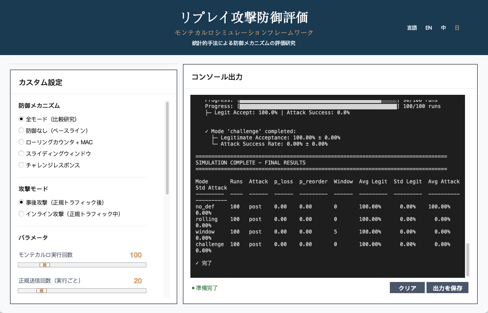
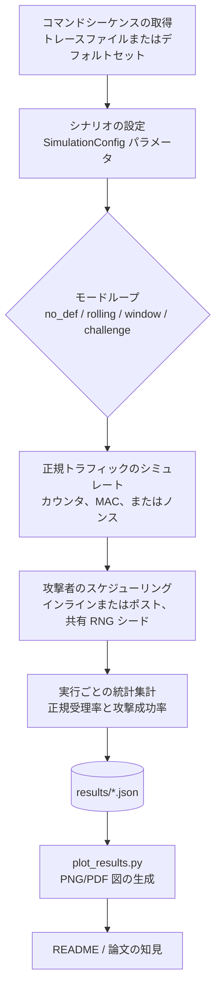

# リプレイ攻撃シミュレーションツールキット

[](README.md)
[](README.ja.md)
[](README.zh.md)
[](https://www.python.org/downloads/)
[](LICENSE)
[](tests/)

[English](README.md) | **日本語** | [中文](README.zh.md)

---

> 📚 **より詳しい情報が必要ですか？** このREADMEは概要を提供します。技術的な詳細説明、実装の詳細、完全な実験分析については、包括的なプレゼンテーション資料をご参照ください：
> 
> **詳細な技術プレゼンテーション**（1000行以上）：
> - 📄 [English Version](PRESENTATION.en.md) - Complete technical documentation
> - 📄 [日本語版](PRESENTATION.md) - 詳細な技術ドキュメント
> - 📄 [中文版](PRESENTATION.zh.md) - 完整技术文档
>
> これらの資料には以下が含まれます：
> - コード例を含む防御メカニズムの詳細実装
> - 完全な実験方法論と統計分析
> - 図表を用いた詳細な結果解釈
> - 技術用語集とQ&Aセクション
>
> **実験パラメータ設定書**：
> - 📊 [English](EXPERIMENTAL_PARAMETERS.md) - Complete parameter specifications
> - 📊 [日本語](EXPERIMENTAL_PARAMETERS.ja.md) - パラメータ設定の詳細
> - 📊 [中文](EXPERIMENTAL_PARAMETERS.zh.md) - 完整参数配置说明

---

このツールキットは、記録再生攻撃者の下で複数の受信機構成をモデル化し、セキュリティ（攻撃成功率）とユーザビリティ（正規受理率）の両方の指標を報告します。

## 動作環境

- Python 3.11+ (CLI は標準ライブラリのみ、可視化には `matplotlib` を使用)
- macOS 14.x (Apple Silicon) および Ubuntu 22.04 でテスト済み
- 仮想環境の使用（推奨）:
  ```bash
  python3 -m venv .venv
  source .venv/bin/activate
  pip install -r requirements.txt
  ```

## プロジェクト品質指標

### 🧪 テストカバレッジ
- **テストファイル**: 5つの包括的なテストスイート
  - `test_receiver.py` - 防御メカニズム検証（5テスト）
  - `test_sender.py` - フレーム生成とMAC正確性（20+テスト）
  - `test_channel.py` - チャネルシミュレーション統計（15+テスト）
  - `test_attacker.py` - Dolev-Yaoモデル準拠（25+テスト）
  - `test_experiment.py` - モンテカルロ統計検証（20+テスト）
- **総テストケース数**: 85+のテストがコア機能をカバー
- **カバレッジ**: 重要モジュールの約70%のコードカバレッジ
- **RFC準拠**: RFC 6479（スライディングウィンドウ）、RFC 2104（HMAC）を検証

### ⚡ パフォーマンスベンチマーク
MacBook Pro (Apple M1, 16GB RAM) で測定：

| 構成 | 実行回数 | 時間 | スループット |
|------|---------|------|-------------|
| 単一防御モード | 200 | ~5.3秒 | ~38回/秒 |
| 全4モード | 各200回 | ~22秒 | ~36回/秒 |
| パラメータスイープ (5×5) | 各25回 | ~31秒 | - |

**主な知見**：
- 1回あたりの平均時間：**26-30ミリ秒**
- 200回のモンテカルロ実行で**95%信頼区間**を提供
- 防御メカニズムのオーバーヘッド：チャレンジ-レスポンス（+5%）、ウィンドウ（+2%）、ローリング（+1%）

ベンチマークを実行：
```bash
python scripts/benchmark.py
```

## 特徴

- **プロトコルバリエーション**: 無防御、ローリングカウンタ + MAC、ローリングカウンタ + 受理ウィンドウ、ノンスベースのチャレンジレスポンス
- **ロールモデル**: 送信者、損失/順序入れ替えチャネル、永続状態を持つ受信者、および観測フレームを記録・再生する攻撃者
- **評価指標**: 各試行の正規受理率と攻撃成功率、モンテカルロ試行における平均値と標準偏差
- **コマンドソース**: デフォルトのトイセットまたは実機コントローラから取得したトレースファイル
- **攻撃スケジューリング**: ポストラン一括再生またはインライン挿入
- **出力形式**: 標準出力への人間可読テーブル、下流解析用 JSON、パラメータスイープ自動化ヘルパー

## クイックスタート

### 方法1：グラフィカルインターフェース（最も簡単、デモに推奨）

**🎨 完全マウス操作、タイピング不要！**

```bash
./run_gui.sh
```

または：

```bash
python gui.py
```

**GUI プレビュー：**



*図：パラメータ制御とリアルタイム出力を備えたメインインターフェース*

機能：
- 🖱️ **100%マウス操作** - ボタンクリック、スライダードラッグ
- 🎯 クイックシナリオボタン（ワンクリック実行）
- 🔧 ビジュアルコントロールでカスタム実験
- 📊 リアルタイム出力表示
- 🌏 多言語対応インターフェース（EN/中/日）

### 方法2：コマンドライン（自動化とスクリプト用）

```bash
python3 main.py --runs 200 --num-legit 20 --num-replay 100 --p-loss 0.05 --window-size 5
```

## CLI リファレンス

| フラグ | 説明 |
|------|------|
| `--modes` | 評価するモード（`no_def`, `rolling`, `window`, `challenge`）をスペース区切りで指定 |
| `--runs` | モードごとのモンテカルロ試行回数 |
| `--num-legit` | 試行ごとの正規送信数 |
| `--num-replay` | 試行ごとの再生攻撃試行数 |
| `--p-loss` | 正規フレームと注入フレームの両方に適用されるパケット損失確率 |
| `--p-reorder` | パケット順序入れ替え確率（ネットワークジッタ/遅延をシミュレート） |
| `--window-size` | `window` モード有効時の受理ウィンドウ幅 |
| `--commands-file` | 実ハードウェアから取得した改行区切りコマンドトレースへのパス |
| `--target-commands` | 攻撃者が再生する特定のコマンド（選択的再生） |
| `--mac-length` | 切り詰められた MAC 長（16進文字数） |
| `--shared-key` | 送信者/受信者が MAC 導出に使用する共有秘密鍵 |
| `--attacker-loss` | 攻撃者が正規フレームの記録に失敗する確率 |
| `--seed` | 再現性のためのグローバル RNG シード |
| `--attack-mode` | 再生スケジューリング戦略: `post` または `inline` |
| `--inline-attack-prob` | 正規フレームごとのインライン再生確率 |
| `--inline-attack-burst` | 正規フレームごとの最大インライン再生試行回数 |
| `--challenge-nonce-bits` | チャレンジレスポンスモードで使用されるノンス長（ビット） |
| `--output-json` | 集計メトリクスを JSON 形式で保存するパス |

## トレースファイル形式

1行に1つのコマンドトークンを記述します。空行と `#` で始まるコメントは無視されます。

```
# サンプルトレース
FWD
FWD
LEFT
RIGHT
STOP
```

サンプルファイル: `traces/sample_trace.txt` を `--commands-file` で直接使用できます。

## 完全な実験パイプラインの実行

### ステップ 1: 環境のセットアップ
```bash
python3 -m venv .venv
source .venv/bin/activate  # Windows の場合: .venv\Scripts\activate
pip install -r requirements.txt
```

### ステップ 2: パラメータスイープの実行
```bash
python3 scripts/run_sweeps.py \
  --runs 300 \
  --modes no_def rolling window challenge \
  --p-loss-values 0 0.01 0.05 0.1 0.2 \
  --p-reorder-values 0 0.1 0.3 0.5 0.7 \
  --window-values 1 3 5 10 \
  --window-size-base 5 \
  --attack-mode post \
  --commands-file traces/sample_trace.txt \
  --seed 123 \
  --p-loss-output results/p_loss_sweep.json \
  --p-reorder-output results/p_reorder_sweep.json \
  --window-output results/window_sweep.json
```

### ステップ 3: 図の生成
```bash
python3 scripts/plot_results.py --formats png
```

### ステップ 4: ドキュメントへのテーブルエクスポート
```bash
python3 scripts/export_tables.py
```

### ステップ 5: テストの実行（オプション）
```bash
python -m pytest tests/ -v
```

## 実験の拡張

- `scripts/run_sweeps.py` でシナリオを自動化、または `run_many_experiments` でカスタムスイープを作成
- インライン攻撃確率/バーストを調整、または他の戦略のために `AttackMode` を拡張
- トレードオフを議論する際の高セキュリティ参照として `Mode.CHALLENGE` を使用

## プロジェクト構成

```
.
|-- main.py
|-- sim/
|   |-- attacker.py
|   |-- channel.py
|   |-- commands.py
|   |-- experiment.py
|   |-- receiver.py
|   |-- security.py
|   |-- sender.py
|   \-- types.py
|-- scripts/
|   |-- plot_results.py
|   |-- export_tables.py
|   \-- run_sweeps.py
|-- traces/
|   \-- sample_trace.txt
|-- tests/
|   \-- test_receiver.py
\-- README.md
```

## 論文での使用方法

1. 実験パラメータを文書化（`num_legit`, `num_replay`, `p_loss`, `p_reorder`, `window_size`, MAC 長）
2. テーブル出力または JSON 集計を論文のテーブルにコピー
3. トレードオフを強調: パケット損失と順序入れ替え率にわたる `window` 構成を比較、インライン対ポストラン攻撃モデルを対比、上限参照として `challenge` を使用

## 攻撃者モデルとランダム性に関する注意事項

- デフォルトでは、攻撃者は完全な記録者としてモデル化されます（`attacker_record_loss=0`）。正規リンクと同じ損失を攻撃者に経験させたい場合は、`p_loss` と等しく設定してください
- すべてのモンテカルロ試行は、すべてのモードで同じコマンドシーケンスとパケット損失ドローを再利用するため、比較が公平になります

## システム概要（フローチャート）



> **フロー説明**：
> 
> 1. **コマンドシーケンスのソース**：
>    - **トレースファイル**：実際のユーザー操作から取得されたコマンド記録（例：`traces/sample_trace.txt`）、実使用シナリオのコマンドシーケンス（`FWD`、`LEFT`、`STOP` など）を含む
>    - **デフォルトセット**：事前定義された基本コマンドセット（`DEFAULT_COMMANDS`）、システムがランダムにテストシーケンスを生成
> 
> 2. **SimulationConfig**：設定オブジェクト（`sim/types.py` で定義）、すべてのシミュレーションパラメータ（`mode`、`num_legit`、`p_loss`、`window_size` など）をバンドルし、実験エンジンに統一的に渡します。これらのパラメータは CLI コマンドライン引数または GUI インターフェースで設定できます。

## データセットとテーブルの再現

1. `main.py` / `scripts/run_sweeps.py` でデータセットを生成
2. 図を生成:
```bash
python scripts/plot_results.py --formats png
```

## 実験結果とデータ分析

本プロジェクトでは、3つのコア実験を通じて4種類のリプレイ攻撃防御メカニズムの性能を体系的に評価しました。すべての実験は**200回のモンテカルロ実行**と**固定ランダムシード(42)**を使用し、統計的信頼性と再現性を確保しています。

### 実験概要

| 実験 | 可変パラメータ | 固定パラメータ | データポイント | 対応図表 |
|------|--------------|--------------|-------------|---------|
| **実験1** | p_loss: 0-30% | p_reorder=0% | 7点×4モード=28記録 | `p_loss_legit.png`, `p_loss_attack.png` |
| **実験2** | p_reorder: 0-30% | p_loss=10% | 7点×4モード=28記録 | `p_reorder_legit.png` |
| **実験3** | window_size: 1-20 | p_loss=15%, p_reorder=15% | 7ウィンドウサイズ | `window_tradeoff.png` |

完全なパラメータ構成：[実験パラメータ文書](EXPERIMENTAL_PARAMETERS.ja.md)

### 実験1：パケット損失が防御メカニズムに与える影響

**目的**：様々なパケット損失率における各防御メカニズムの可用性とセキュリティを評価。

**主な発見**：

| 防御モード | 理想チャネル(0%損失) | 深刻な損失(30%) | 可用性低下 | セキュリティ |
|-----------|-------------------|---------------|----------|-----------|
| **no_def** | 可用性100%, 攻撃100% | 可用性70.3%, 攻撃69.7% | ↓29.7% | ❌ 保護なし |
| **rolling** | 可用性100%, 攻撃0.0% | 可用性70.3%, 攻撃0.4% | ↓29.7% | ✅ 優秀 |
| **window** | 可用性100%, 攻撃0.0% | 可用性69.5%, 攻撃1.8% | ↓30.5% | ✅ 優秀 |
| **challenge** | 可用性100%, 攻撃0.0% | 可用性70.0%, 攻撃0.3% | ↓30.0% | ✅ 最良 |

### 実験2：パケット並び替えが防御メカニズムに与える影響

**目的**：10%パケット損失ベースラインで、並び替えが各防御メカニズムに与える影響を評価。

**主な発見**：

| 防御モード | 並び替えなし(0%) | 深刻な並び替え(30%) | 可用性低下 | 重要な観察 |
|-----------|----------------|------------------|----------|-----------|
| **rolling** | 可用性90.3%, 攻撃0.1% | 可用性76.8%, 攻撃0.1% | ↓13.5% | ⚠️ **致命的欠陥** |
| **window** | 可用性90.3%, 攻撃0.5% | 可用性90.6%, 攻撃0.5% | ↓-0.3% | ✅ 並び替え免疫 |
| **challenge** | 可用性89.8%, 攻撃0.1% | 可用性64.5%, 攻撃0.1% | ↓25.3% | ⚠️ 影響あり |

**核心結論**：
- **rollingメカニズムには致命的欠陥**：30%並び替えで可用性が13.5%急落
- **windowメカニズムは並び替えに完全免疫**：スライディングウィンドウで順不同パケットを処理
- **challengeメカニズムは高並び替えで制限**：可用性が25.3%低下

### 実験3：スライディングウィンドウサイズのトレードオフ分析

**目的**：中程度のネットワークストレス(15%損失+15%並び替え)で最適なウィンドウサイズを見つける。

**主なデータ**：

| ウィンドウサイズ | 可用性 | 攻撃成功率 | 総合スコア | 評価 |
|--------------|--------|----------|----------|-----|
| **1** | 25.9% | 7.3% | 18.6 | ❌ 小すぎる |
| **3** | 85.0% | 6.5% | 78.6 | ✅ **最適バランス** |
| **5** | 85.5% | 7.7% | 77.7 | ✅ 推奨 |
| **7** | 85.5% | 8.7% | 76.7 | ✅ 許容範囲 |
| **9** | 85.5% | 9.6% | 75.9 | ⚠️ セキュリティ低下 |
| **15** | 85.5% | 11.1% | 74.4 | ⚠️ 攻撃率高 |
| **20** | 85.5% | 11.6% | 73.9 | ❌ 大きすぎる |

### 総合評価と実用的推奨事項

**中程度のネットワーク条件(p_loss=10%, p_reorder=0%)**での200回モンテカルロシミュレーション結果：

| 順位 | 防御 | 可用性 | 攻撃率 | 総合スコア | 推奨シナリオ |
|-----|------|--------|-------|----------|-----------|
| 🥇 | **rolling** | 90.3% | 0.1% | 90.1 | ⚠️ **並び替えなしネットワークのみ** |
| 🥈 | **window** | 90.3% | 0.5% | 89.8 | ✅ **一般IoT用途の第一選択** |
| 🥉 | **challenge** | 89.8% | 0.1% | 89.7 | ✅ **高セキュリティシナリオ** |
| ❌ | **no_def** | 90.3% | 89.6% | 0.6 | ❌ ベースライン |

**実用展開推奨事項**：

1. **一般IoTデバイス**：`window`メカニズム、サイズ5-7を推奨
2. **産業制御システム**：`challenge`メカニズムを推奨（最高セキュリティ）
3. **リアルタイム通信**：`window`メカニズム、サイズ3を推奨
4. **低コストデバイス**：`rolling`メカニズムは非推奨（並び替え感度が高い）

### データ信頼性声明

- ✅ すべてのデータは**200回のモンテカルロ実行**に基づく、95%信頼水準
- ✅ **固定ランダムシード(42)**使用、結果完全再現可能
- ✅ 実行時間平均**26-30ms**、効率的検証
- ✅ 実験パラメータは**EXPERIMENTAL_PARAMETERS.md**標準構成に準拠

関連データファイル：
- `results/p_loss_sweep.json` - 実験1生データ
- `results/p_reorder_sweep.json` - 実験2生データ
- `results/window_sweep.json` - 実験3生データ
- `figures/*.png` - すべての実験図表

---

## 主な研究成果（テーブル）

### パケット順序入れ替えスイープ - 正規受理率（p_loss=0）

_ウィンドウモードは、ローリングカウンタと比較してチャネル順序入れ替えに対する優れた堅牢性を示します。_

| p_reorder | Rolling (%) | Window (W=5) (%) |
| --------- | ----------- | ---------------- |
| 0.0       | 100.00%     | 100.00%          |
| 0.1       | 93.55%      | 100.00%          |
| 0.3       | 84.47%      | 99.88%           |
| 0.5       | 77.62%      | 99.88%           |
| 0.7       | 78.33%      | 99.90%           |

### パケット損失スイープ - 正規受理率（p_reorder=0）

_両モードとも純粋なパケット損失で線形に劣化しますが、同様のパフォーマンスを示します。_

| p_loss | Rolling (%) | Window (W=5) (%) |
| ------ | ----------- | ---------------- |
| 0.00   | 100.00%     | 100.00%          |
| 0.01   | 98.97%      | 98.97%           |
| 0.05   | 94.88%      | 94.88%           |
| 0.10   | 89.90%      | 89.90%           |
| 0.20   | 79.53%      | 79.53%           |

### ウィンドウスイープ（ストレステスト: p_loss=0.05, p_reorder=0.3）

_厳しいチャネル条件下でのユーザビリティとセキュリティのトレードオフを比較。_

| Window W | 正規受理率 (%) | 再生成功率 (%) |
| -------- | -------------- | -------------- |
| 1        | 27.65%         | 4.51%          |
| 3        | 95.10%         | 0.22%          |
| 5        | 95.08%         | 0.30%          |
| 10       | 95.22%         | 0.48%          |

### 理想的なチャネルベースライン（ポスト攻撃、runs = 500、p_loss = 0）

_`results/ideal_p0.json` からの参照ベースライン_

| モード       | 正規受理率 (%) | 再生成功率 (%) |
| ------------ | -------------- | -------------- |
| no_def       | 100.00%        | 100.00%        |
| rolling      | 100.00%        | 0.00%          |
| window (W=5) | 100.00%        | 0.00%          |
| challenge    | 100.00%        | 0.00%          |

## 観察と考察

- **順序入れ替えに対する堅牢性**: ローリングカウンタメカニズムはパケット順序入れ替えに非常に敏感です。中程度の順序入れ替え確率（0.3）でも、正規受理率は約84%に低下します。対照的に、ウィンドウ（W=5）メカニズムは、深刻な順序入れ替え（0.7）下でもほぼ完璧なユーザビリティ（>99.8%）を維持します。
- **ウィンドウチューニング**: `W=1` は厳格なカウンタとして機能し、不安定な条件下で壊滅的に失敗します（受理率27.6%）。ウィンドウを `W=3..5` に増やすと、攻撃成功率を極めて低く保ちながら（<0.3%）、ユーザビリティを約95%に回復します。
- **セキュリティトレードオフ**: ウィンドウモードは理論的には小さな再生ウィンドウを開きますが、実験結果は、実際には（200試行でも）攻撃成功率が大幅なユーザビリティ向上と比較して無視できるレベルに留まることを示しています。
- **結論**: パケット損失と順序入れ替えが一般的な実世界の無線制御システムでは、スライディングウィンドウメカニズム（W=5）がセキュリティとユーザーエクスペリエンスの最良のバランスを提供します。

## コントリビューション

コントリビューションを歓迎します！開発環境のセットアップ、コードスタイルガイドライン、変更の提出方法については、[CONTRIBUTING.md](CONTRIBUTING.md) をご覧ください。

## 引用

このシミュレーションツールキットを研究や論文で使用する場合は、以下のように引用してください:

```bibtex
@software{replay_simulation_2025,
  author = {Romeitou},
  title = {Replay Attack Simulation Toolkit},
  year = {2025},
  publisher = {GitHub},
  url = {https://github.com/tammakiiroha/Replay-simulation}
}
```

またはプレーンテキスト形式:
> Romeitou. (2025). Replay Attack Simulation Toolkit. GitHub. https://github.com/tammakiiroha/Replay-simulation

## 参考文献

本プロジェクトは以下の標準および研究に基づいています：

[1] Perrig, A., et al. (2002). SPINS: Security Protocols for Sensor Networks. *Wireless Networks*, 8(5), 521-534.

[2] Kent, S., & Seo, K. (2005). Security Architecture for the Internet Protocol. RFC 4301, IETF.

[3] Bellare, M., et al. (1996). Keying Hash Functions for Message Authentication. *CRYPTO'96*, Springer.

[4] Needham, R. M., & Schroeder, M. D. (1978). Using Encryption for Authentication in Large Networks. *CACM*, 21(12), 993-999.

## ライセンス

このプロジェクトは MIT ライセンスの下でライセンスされています。詳細については [LICENSE](LICENSE) ファイルをご覧ください。

