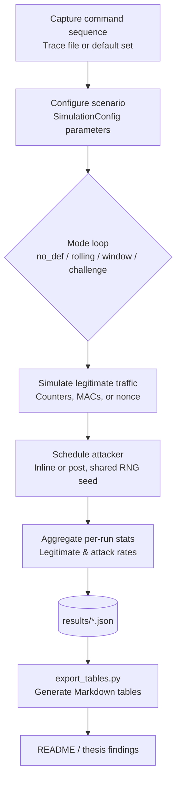

# Replay Attack Simulation Toolkit

This toolkit reproduces the replay-attack evaluation plan described in the project brief. It models multiple receiver configurations under a record-and-replay adversary and reports both security (attack success) and usability (legitimate acceptance) metrics.

## Requirements
- Python 3.11+ (stdlib only for the CLI; optional helpers rely on `matplotlib`)
- Tested on macOS 14.x (Apple Silicon) and Ubuntu 22.04
- Optional virtualenv:
  ```bash
  python3 -m venv .venv
  source .venv/bin/activate
  pip install -r requirements.txt
  ```

## Features
- **Protocol variants**: no defense, rolling counter + MAC, rolling counter + acceptance window, and a nonce-based challenge-response baseline.
- **Role models**: sender, lossy channel, receiver with persistent state, and an attacker that records and replays observed frames.
- **Metrics**: per-run legitimate acceptance rate and attack success rate, plus aggregated averages and standard deviations across Monte Carlo runs.
- **Command sources**: random commands from a default toy set or a trace file captured from a real controller.
- **Attacker scheduling**: choose between post-run burst replay or inline injection during legitimate traffic.
- **Outputs**: human-readable tables on stdout, JSON dumps for downstream analysis, and automation helpers for parameter sweeps.

## Quick start
```bash
python3 main.py --runs 200 --num-legit 20 --num-replay 100 --p-loss 0.05 --window-size 5
```

## CLI reference
| Flag | Description |
|------|-------------|
| `--modes` | Space-separated list of modes to evaluate (`no_def`, `rolling`, `window`, `challenge`). |
| `--runs` | Number of Monte Carlo repetitions per mode. |
| `--num-legit` | Legitimate transmissions per run. |
| `--num-replay` | Replay attempts per run. |
| `--p-loss` | Packet-loss probability applied to both legitimate and injected frames. |
| `--window-size` | Acceptance-window width when mode `window` is active. |
| `--commands-file` | Path to a newline-delimited command trace captured from real hardware. |
| `--mac-length` | Truncated MAC length (hex chars). |
| `--shared-key` | Shared secret used by sender/receiver to derive MACs. |
| `--attacker-loss` | Probability that the attacker fails to record a legitimate frame. |
| `--seed` | Global RNG seed for reproducibility. |
| `--attack-mode` | Replay scheduling strategy: `post` or `inline`. |
| `--inline-attack-prob` | Inline replay probability per legitimate frame. |
| `--inline-attack-burst` | Maximum inline replay attempts per legitimate frame. |
| `--challenge-nonce-bits` | Nonce length (bits) used by the challenge-response mode. |
| `--output-json` | Path to save aggregate metrics in JSON form. |

## Trace file format
Provide one command token per line; empty lines and `#` comments are ignored.

```
# sample trace
FWD
FWD
LEFT
RIGHT
STOP
```

Sample file: `traces/sample_trace.txt` can be used directly with `--commands-file`.

## Parameter sweeps
```bash
python3 scripts/run_sweeps.py \
  --runs 300 \
  --modes no_def rolling window challenge \
  --p-loss-values 0 0.01 0.05 0.1 0.2 \
  --window-values 1 3 5 7 9 \
  --window-size-base 5 \
  --attack-mode inline \
  --inline-attack-prob 0.4 \
  --inline-attack-burst 2 \
  --commands-file traces/sample_trace.txt \
  --seed 123 \
  --p-loss-output results/p_loss_sweep.json \
  --window-output results/window_sweep.json
```

## Extending experiments
- Automate scenarios via `scripts/run_sweeps.py` or craft custom sweeps with `run_many_experiments`.
- Adjust inline attack probabilities/bursts or extend `AttackMode` for other strategies.
- Use `Mode.CHALLENGE` as a high-security reference when discussing trade-offs.

## Project structure
```
.
|-- main.py
|-- sim/
|   |-- attacker.py
|   |-- channel.py
|   |-- commands.py
|   |-- experiment.py
|   |-- receiver.py
|   |-- security.py
|   |-- sender.py
|   \-- types.py
|-- scripts/
|   \-- run_sweeps.py
|-- traces/
|   \-- sample_trace.txt
\-- README.md
```

## Using the results in the thesis
1. Document the experimental parameters (`num_legit`, `num_replay`, `p_loss`, `window_size`, MAC length).
2. Copy the table outputs or the JSON aggregates into your thesis tables.
3. Highlight trade-offs: compare `window` configurations across packet-loss rates, contrast inline vs post-run attack models, and use `challenge` as an upper-bound reference.

## Notes on attacker model and randomness
- By default the attacker is modeled with a perfect recorder (`attacker_record_loss=0`); set it equal to `p_loss` if you want the attacker to experience the same losses as the legitimate link.
- Every Monte Carlo run reuses the same command sequence and packet-loss draws across all modes so that comparisons remain apples-to-apples.

## Overview (flow chart)


## Reproducing the datasets and tables
1. Generate datasets with `main.py` / `scripts/run_sweeps.py`.
2. Export Markdown tables:
   ```bash
   source .venv/bin/activate  # optional
   python scripts/export_tables.py
   ```

## Key findings (tables)

### Packet-loss sweep -  legitimate acceptance
| p_loss | no_def | rolling | window | challenge |
| --- | --- | --- | --- | --- |
| 0.00 | 100.00% | 100.00% | 100.00% | 100.00% |
| 0.01 | 99.05% | 99.05% | 99.05% | 98.98% |
| 0.05 | 94.92% | 94.92% | 94.92% | 94.62% |
| 0.10 | 89.70% | 89.70% | 89.70% | 89.57% |
| 0.20 | 79.60% | 79.60% | 79.58% | 79.70% |

### Packet-loss sweep -  replay success
| p_loss | no_def | rolling | window | challenge |
| --- | --- | --- | --- | --- |
| 0.00 | 100.00% | 0.00% | 0.00% | 0.00% |
| 0.01 | 98.54% | 0.00% | 0.00% | 0.00% |
| 0.05 | 94.61% | 0.03% | 0.03% | 0.00% |
| 0.10 | 89.73% | 0.10% | 0.10% | 0.00% |
| 0.20 | 80.15% | 0.47% | 0.50% | 0.00% |

### Window sweep (p_loss = 0.05, post attack)
| Window W | Legitimate (%) | Replay success (%) |
| --- | --- | --- |
| 1 | 62.32% | 2.8467% |
| 3 | 94.88% | 0.0533% |
| 5 | 95.07% | 0.0567% |
| 7 | 95.02% | 0.0333% |
| 9 | 94.67% | 0.0467% |

See `docs/metrics_tables.md` for the full Markdown tables.

### Ideal channel baseline (post attack, runs = 500, p_loss = 0)
| Mode | Legitimate (%) | Replay success (%) | Source |
| --- | --- | --- | --- |
| no_def | 100.00% | 100.00% | `results/ideal_p0.json` |
| rolling | 100.00% | 0.00% | `results/ideal_p0.json` |
| window (W=5) | 100.00% | 0.00% | `results/ideal_p0.json` |
| challenge | 100.00% | 0.00% | `results/ideal_p0.json` |

### Trace-driven inline scenario (real command trace, runs = 300, p_loss = 0)
| Mode | Legitimate (%) | Replay success (%) | Source |
| --- | --- | --- | --- |
| no_def | 100.00% | 100.00% | `results/trace_inline.json` |
| rolling | 100.00% | 0.00% | `results/trace_inline.json` |
| window (W=5) | 100.00% | 0.00% | `results/trace_inline.json` |
| challenge | 100.00% | 0.00% | `results/trace_inline.json` |

## Observations and insights
- Baseline gap: without defenses, every captured frame replays successfully even on an ideal channel, while rolling/window defenses instantly drop replay success to 0% with no usability penalty (table: Ideal channel baseline).
- Packet-loss resilience: across `p_loss` from 0 to 0.2, rolling and window modes keep legitimate acceptance within 80-100% and hold replay success below 0.5%, whereas no_def degrades almost linearly with `p_loss` and mirrors that degradation in attack success (tables: Packet-loss sweep).
- Window tuning: `W=1` is overly strict (legitimate 62%) because a single drop causes permanent desynchronization. The range `W=3..7` maintains ~95% usability while keeping replay success below 0.06%, showing the security-usability sweet spot (table: Window sweep at p_loss = 0.05).
- Inline attacker realism: even when using a real command trace and inline injections, rolling/window/challenge remain at 0% replay success, confirming that the protections do not depend on synthetic traffic (table: Trace-driven inline scenario).
- Challenge-response as upper bound: the challenge mode consistently matches rolling/window on legitimate acceptance but never allows replays, validating it as a security upper bound that can anchor "ideal" comparisons in the thesis.
