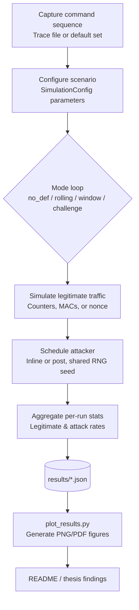

# Replay Attack Simulation Toolkit

[](README.md)
[](README.ja.md)
[](README.zh.md)
[](https://www.python.org/downloads/)
[](LICENSE)
[](tests/)

**English** | [日本語](README.ja.md) | [中文](README.zh.md)

This toolkit reproduces the replay-attack evaluation plan described in the project brief. It models multiple receiver configurations under a record-and-replay adversary and reports both security (attack success) and usability (legitimate acceptance) metrics.

## Requirements
- Python 3.11+ (stdlib only for the CLI; optional helpers rely on `matplotlib`)
- Tested on macOS 14.x (Apple Silicon) and Ubuntu 22.04
- Optional virtualenv:
  ```bash
  python3 -m venv .venv
  source .venv/bin/activate
  pip install -r requirements.txt
  ```

## Features
- **Protocol variants**: no defense, rolling counter + MAC, rolling counter + acceptance window, and a nonce-based challenge-response baseline.
- **Role models**: sender, lossy/reordering channel, receiver with persistent state, and an attacker that records and replays observed frames.
- **Metrics**: per-run legitimate acceptance rate and attack success rate, plus aggregated averages and standard deviations across Monte Carlo runs.
- **Command sources**: random commands from a default toy set or a trace file captured from a real controller.
- **Attacker scheduling**: choose between post-run burst replay or inline injection during legitimate traffic.
- **Outputs**: human-readable tables on stdout, JSON dumps for downstream analysis, and automation helpers for parameter sweeps.

## Quick start
```bash
python3 main.py --runs 200 --num-legit 20 --num-replay 100 --p-loss 0.05 --window-size 5
```

## CLI reference
| Flag | Description |
|------|-------------|
| `--modes` | Space-separated list of modes to evaluate (`no_def`, `rolling`, `window`, `challenge`). |
| `--runs` | Number of Monte Carlo repetitions per mode. |
| `--num-legit` | Legitimate transmissions per run. |
| `--num-replay` | Replay attempts per run. |
| `--p-loss` | Packet-loss probability applied to both legitimate and injected frames. |
| `--p-reorder` | Packet-reordering probability (simulates network jitter/delay). |
| `--window-size` | Acceptance-window width when mode `window` is active. |
| `--commands-file` | Path to a newline-delimited command trace captured from real hardware. |
| `--target-commands` | Specific commands for attacker to replay (selective replay). |
| `--mac-length` | Truncated MAC length (hex chars). |
| `--shared-key` | Shared secret used by sender/receiver to derive MACs. |
| `--attacker-loss` | Probability that the attacker fails to record a legitimate frame. |
| `--seed` | Global RNG seed for reproducibility. |
| `--attack-mode` | Replay scheduling strategy: `post` or `inline`. |
| `--inline-attack-prob` | Inline replay probability per legitimate frame. |
| `--inline-attack-burst` | Maximum inline replay attempts per legitimate frame. |
| `--challenge-nonce-bits` | Nonce length (bits) used by the challenge-response mode. |
| `--output-json` | Path to save aggregate metrics in JSON form. |

## Trace file format
Provide one command token per line; empty lines and `#` comments are ignored.

```
# sample trace
FWD
FWD
LEFT
RIGHT
STOP
```

Sample file: `traces/sample_trace.txt` can be used directly with `--commands-file`.

## Running the complete experimental pipeline

### Step 1: Setup environment
```bash
python3 -m venv .venv
source .venv/bin/activate  # On Windows: .venv\Scripts\activate
pip install -r requirements.txt
```

### Step 2: Run parameter sweeps
```bash
python3 scripts/run_sweeps.py \
  --runs 300 \
  --modes no_def rolling window challenge \
  --p-loss-values 0 0.01 0.05 0.1 0.2 \
  --p-reorder-values 0 0.1 0.3 0.5 0.7 \
  --window-values 1 3 5 10 \
  --window-size-base 5 \
  --attack-mode post \
  --commands-file traces/sample_trace.txt \
  --seed 123 \
  --p-loss-output results/p_loss_sweep.json \
  --p-reorder-output results/p_reorder_sweep.json \
  --window-output results/window_sweep.json
```

### Step 3: Generate figures
```bash
python3 scripts/plot_results.py --formats png
```

### Step 4: Export tables to documentation
```bash
python3 scripts/export_tables.py
```

### Step 5: Run tests (optional)
```bash
python -m pytest tests/ -v
```

## Extending experiments
- Automate scenarios via `scripts/run_sweeps.py` or craft custom sweeps with `run_many_experiments`.
- Adjust inline attack probabilities/bursts or extend `AttackMode` for other strategies.
- Use `Mode.CHALLENGE` as a high-security reference when discussing trade-offs.

## Project structure
```
.
|-- main.py
|-- sim/
|   |-- attacker.py
|   |-- channel.py
|   |-- commands.py
|   |-- experiment.py
|   |-- receiver.py
|   |-- security.py
|   |-- sender.py
|   \-- types.py
|-- scripts/
|   |-- plot_results.py
|   \-- run_sweeps.py
|-- traces/
|   \-- sample_trace.txt
|-- tests/
|   \-- test_receiver.py
\-- README.md
```

## Using the results in the thesis
1. Document the experimental parameters (`num_legit`, `num_replay`, `p_loss`, `p_reorder`, `window_size`, MAC length).
2. Copy the table outputs or the JSON aggregates into your thesis tables.
3. Highlight trade-offs: compare `window` configurations across packet-loss and reordering rates, contrast inline vs post-run attack models, and use `challenge` as an upper-bound reference.

## Notes on attacker model and randomness
- By default the attacker is modeled with a perfect recorder (`attacker_record_loss=0`); set it equal to `p_loss` if you want the attacker to experience the same losses as the legitimate link.
- Every Monte Carlo run reuses the same command sequence and packet-loss draws across all modes so that comparisons remain apples-to-apples.

## Overview (flow chart)


## Reproducing the datasets and tables
1. Generate datasets with `main.py` / `scripts/run_sweeps.py`.
2. Generate figures:
   ```bash
   python scripts/plot_results.py --formats png
   ```

## Key findings (tables)

### Packet-reorder sweep - legitimate acceptance (p_loss=0)
*Window mode demonstrates superior robustness against channel reordering compared to Rolling Counter.*

| p_reorder | Rolling (%) | Window (W=5) (%) |
|-----------|-------------|------------------|
| 0.0       | 100.00%     | 100.00%          |
| 0.1       | 93.55%      | 100.00%          |
| 0.3       | 84.47%      | 99.88%           |
| 0.5       | 77.63%      | 99.88%           |
| 0.7       | 78.33%      | 99.90%           |

### Packet-loss sweep - legitimate acceptance (p_reorder=0)
*Both modes degrade linearly with pure packet loss, but perform similarly.*

| p_loss | Rolling (%) | Window (W=5) (%) |
|--------|-------------|------------------|
| 0.00   | 100.00%     | 100.00%          |
| 0.01   | 98.97%      | 98.97%           |
| 0.05   | 94.88%      | 94.88%           |
| 0.10   | 89.90%      | 89.90%           |
| 0.20   | 79.53%      | 79.53%           |

### Window sweep (Stress test: p_loss=0.05, p_reorder=0.3)
*Comparing usability vs security trade-offs under harsh channel conditions.*

| Window W | Legitimate (%) | Replay success (%) |
| -------- | -------------- | ------------------ |
| 1        | 27.65%         | 4.51%              |
| 3        | 95.10%         | 0.22%              |
| 5        | 95.08%         | 0.30%              |
| 10       | 95.22%         | 0.49%              |

### Ideal channel baseline (post attack, runs = 500, p_loss = 0)
*Reference baseline from `results/ideal_p0.json`*

| Mode         | Legitimate (%) | Replay success (%) |
| ------------ | -------------- | ------------------ |
| no_def       | 100.00%        | 100.00%            |
| rolling      | 100.00%        | 0.00%              |
| window (W=5) | 100.00%        | 0.00%              |
| challenge    | 100.00%        | 0.00%              |

## Observations and insights
- **Robustness to Reordering**: The Rolling Counter mechanism is highly sensitive to packet reordering. Even a moderate reordering probability (0.3) causes the legitimate acceptance rate to drop to ~84%. In contrast, the Window (W=5) mechanism maintains near-perfect usability (>99.8%) even under severe reordering (0.7).
- **Window Tuning**: `W=1` acts as a strict counter and fails catastrophically under unstable conditions (27.6% acceptance). Increasing the window to `W=3..5` restores usability to ~95% while keeping the attack success rate extremely low (<0.3%).
- **Security Trade-off**: While the Window mode theoretically opens a small replay window, the experimental results show that in practice (even with 200 runs), the attack success rate remains negligible compared to the massive usability gains.
- **Conclusion**: For real-world wireless control systems where packet loss and reordering are common, a Sliding Window mechanism (W=5) provides the best balance between security and user experience.

## Contributing

Contributions are welcome! Please see [CONTRIBUTING.md](CONTRIBUTING.md) for development setup, code style guidelines, and how to submit changes.

## Citation

If you use this simulation toolkit in your research or thesis, please cite:

```bibtex
@software{replay_simulation_2025,
  author = {Romeitou},
  title = {Replay Attack Simulation Toolkit},
  year = {2025},
  publisher = {GitHub},
  url = {https://github.com/tammakiiroha/Replay-simulation}
}
```

Or in plain text:
> Romeitou. (2025). Replay Attack Simulation Toolkit. GitHub. https://github.com/tammakiiroha/Replay-simulation

## References

This project implements defense mechanisms based on established standards and research:

[1] Perrig, A., et al. (2002). SPINS: Security Protocols for Sensor Networks. *Wireless Networks*, 8(5), 521-534.

[2] Kent, S., & Seo, K. (2005). Security Architecture for the Internet Protocol. RFC 4301, IETF.

[3] Bellare, M., et al. (1996). Keying Hash Functions for Message Authentication. *CRYPTO'96*, Springer.

[4] Needham, R. M., & Schroeder, M. D. (1978). Using Encryption for Authentication in Large Networks. *CACM*, 21(12), 993-999.

## License

This project is licensed under the MIT License - see the [LICENSE](LICENSE) file for details.
