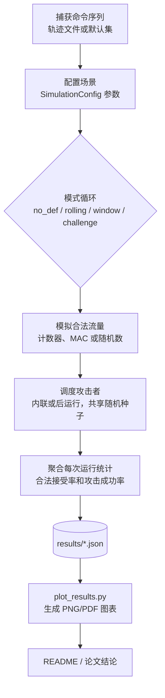

# 重放攻击仿真工具包

[](README.md)
[](README.ja.md)
[](README.zh.md)
[](https://www.python.org/downloads/)
[](LICENSE)
[](tests/)

[English](README.md) | [日本語](README.ja.md) | **中文**

> **技术演示文档**: [English](PRESENTATION.en.md) | [日本語](PRESENTATION.md) | [中文](PRESENTATION.zh.md)

该工具包在记录-重放攻击者模型下对多种接收器配置进行建模，并报告安全性（攻击成功率）和可用性（合法接受率）两方面的指标。

## 运行环境

- Python 3.11+（CLI 仅需标准库；可视化依赖 `matplotlib`）
- 已在 macOS 14.x (Apple Silicon) 和 Ubuntu 22.04 上测试
- 推荐使用虚拟环境：
  ```bash
  python3 -m venv .venv
  source .venv/bin/activate
  pip install -r requirements.txt
  ```

## 功能特性

- **协议变体**：无防御、滚动计数器 + MAC、滚动计数器 + 接受窗口、基于随机数的挑战-响应基线
- **角色模型**：发送方、有损/乱序信道、具有持久状态的接收方、以及记录并重放观察帧的攻击者
- **评估指标**：每次运行的合法接受率和攻击成功率，以及蒙特卡洛试验中的平均值和标准差
- **命令源**：默认玩具集或从真实控制器捕获的轨迹文件
- **攻击调度**：后运行批量重放或内联注入
- **输出格式**：标准输出的人类可读表格、用于下游分析的 JSON、参数扫描自动化助手

## 快速开始

```bash
python3 main.py --runs 200 --num-legit 20 --num-replay 100 --p-loss 0.05 --window-size 5
```

## CLI 参数说明

| 参数 | 说明 |
|------|------|
| `--modes` | 要评估的模式，用空格分隔（`no_def`, `rolling`, `window`, `challenge`） |
| `--runs` | 每个模式的蒙特卡洛重复次数 |
| `--num-legit` | 每次运行的合法传输数量 |
| `--num-replay` | 每次运行的重放攻击尝试次数 |
| `--p-loss` | 应用于合法帧和注入帧的数据包丢失概率 |
| `--p-reorder` | 数据包乱序概率（模拟网络抖动/延迟） |
| `--window-size` | `window` 模式激活时的接受窗口宽度 |
| `--commands-file` | 从真实硬件捕获的换行分隔命令轨迹的路径 |
| `--target-commands` | 攻击者要重放的特定命令（选择性重放） |
| `--mac-length` | 截断的 MAC 长度（十六进制字符数） |
| `--shared-key` | 发送方/接收方用于派生 MAC 的共享密钥 |
| `--attacker-loss` | 攻击者无法记录合法帧的概率 |
| `--seed` | 用于可重现性的全局随机数生成器种子 |
| `--attack-mode` | 重放调度策略：`post` 或 `inline` |
| `--inline-attack-prob` | 每个合法帧的内联重放概率 |
| `--inline-attack-burst` | 每个合法帧的最大内联重放尝试次数 |
| `--challenge-nonce-bits` | 挑战-响应模式使用的随机数长度（比特） |
| `--output-json` | 保存聚合指标为 JSON 格式的路径 |

## 轨迹文件格式

每行一个命令标记；空行和 `#` 开头的注释将被忽略。

```
# 示例轨迹
FWD
FWD
LEFT
RIGHT
STOP
```

示例文件：`traces/sample_trace.txt` 可直接与 `--commands-file` 一起使用。

## 运行完整实验流程

### 步骤 1：设置环境
```bash
python3 -m venv .venv
source .venv/bin/activate  # Windows 系统: .venv\Scripts\activate
pip install -r requirements.txt
```

### 步骤 2：运行参数扫描
```bash
python3 scripts/run_sweeps.py \
  --runs 300 \
  --modes no_def rolling window challenge \
  --p-loss-values 0 0.01 0.05 0.1 0.2 \
  --p-reorder-values 0 0.1 0.3 0.5 0.7 \
  --window-values 1 3 5 10 \
  --window-size-base 5 \
  --attack-mode post \
  --commands-file traces/sample_trace.txt \
  --seed 123 \
  --p-loss-output results/p_loss_sweep.json \
  --p-reorder-output results/p_reorder_sweep.json \
  --window-output results/window_sweep.json
```

### 步骤 3：生成图表
```bash
python3 scripts/plot_results.py --formats png
```

### 步骤 4：导出表格到文档
```bash
python3 scripts/export_tables.py
```

### 步骤 5：运行测试（可选）
```bash
python -m pytest tests/ -v
```

## 扩展实验

- 通过 `scripts/run_sweeps.py` 自动化场景，或使用 `run_many_experiments` 创建自定义扫描
- 调整内联攻击概率/突发次数，或为其他策略扩展 `AttackMode`
- 在讨论权衡时，使用 `Mode.CHALLENGE` 作为高安全性参考

## 项目结构

```
.
|-- main.py
|-- sim/
|   |-- attacker.py
|   |-- channel.py
|   |-- commands.py
|   |-- experiment.py
|   |-- receiver.py
|   |-- security.py
|   |-- sender.py
|   \-- types.py
|-- scripts/
|   |-- plot_results.py
|   |-- export_tables.py
|   \-- run_sweeps.py
|-- traces/
|   \-- sample_trace.txt
|-- tests/
|   \-- test_receiver.py
\-- README.md
```

## 在论文中使用

1. 记录实验参数（`num_legit`、`num_replay`、`p_loss`、`p_reorder`、`window_size`、MAC 长度）
2. 将表格输出或 JSON 聚合复制到论文表格中
3. 突出权衡：跨数据包丢失和乱序率比较 `window` 配置，对比内联与后运行攻击模型，并使用 `challenge` 作为上限参考

## 关于攻击者模型和随机性的说明

- 默认情况下，攻击者被建模为完美记录器（`attacker_record_loss=0`）；如果希望攻击者经历与合法链路相同的损失，请将其设置为等于 `p_loss`
- 每次蒙特卡洛运行在所有模式中重用相同的命令序列和数据包丢失抽样，以确保比较的公平性

## 系统概览（流程图）



## 重现数据集和表格

1. 使用 `main.py` / `scripts/run_sweeps.py` 生成数据集
2. 生成图表：
```bash
python scripts/plot_results.py --formats png
```

## 主要研究成果（表格）

### 数据包乱序扫描 - 合法接受率（p_loss=0）

_窗口模式相比滚动计数器展示了对信道乱序的卓越鲁棒性。_

| p_reorder | Rolling (%) | Window (W=5) (%) |
| --------- | ----------- | ---------------- |
| 0.0       | 100.00%     | 100.00%          |
| 0.1       | 93.55%      | 100.00%          |
| 0.3       | 84.47%      | 99.88%           |
| 0.5       | 77.62%      | 99.88%           |
| 0.7       | 78.33%      | 99.90%           |

### 数据包丢失扫描 - 合法接受率（p_reorder=0）

_两种模式在纯数据包丢失下均线性退化，但表现相似。_

| p_loss | Rolling (%) | Window (W=5) (%) |
| ------ | ----------- | ---------------- |
| 0.00   | 100.00%     | 100.00%          |
| 0.01   | 98.97%      | 98.97%           |
| 0.05   | 94.88%      | 94.88%           |
| 0.10   | 89.90%      | 89.90%           |
| 0.20   | 79.53%      | 79.53%           |

### 窗口扫描（压力测试：p_loss=0.05, p_reorder=0.3）

_在恶劣信道条件下比较可用性与安全性的权衡。_

| Window W | 合法接受率 (%) | 重放成功率 (%) |
| -------- | -------------- | -------------- |
| 1        | 27.65%         | 4.51%          |
| 3        | 95.10%         | 0.22%          |
| 5        | 95.08%         | 0.30%          |
| 10       | 95.22%         | 0.48%          |

### 理想信道基线（后运行攻击，runs = 500，p_loss = 0）

_来自 `results/ideal_p0.json` 的参考基线_

| 模式         | 合法接受率 (%) | 重放成功率 (%) |
| ------------ | -------------- | -------------- |
| no_def       | 100.00%        | 100.00%        |
| rolling      | 100.00%        | 0.00%          |
| window (W=5) | 100.00%        | 0.00%          |
| challenge    | 100.00%        | 0.00%          |

## 观察与见解

- **对乱序的鲁棒性**：滚动计数器机制对数据包乱序高度敏感。即使是中等的乱序概率（0.3）也会导致合法接受率下降到约84%。相比之下，窗口（W=5）机制即使在严重乱序（0.7）下也能保持近乎完美的可用性（>99.8%）。
- **窗口调优**：`W=1` 作为严格计数器，在不稳定条件下会灾难性失败（接受率27.6%）。将窗口增加到 `W=3..5` 可将可用性恢复到约95%，同时保持极低的攻击成功率（<0.3%）。
- **安全性权衡**：虽然窗口模式理论上打开了一个小的重放窗口，但实验结果表明，在实践中（即使进行200次运行），攻击成功率与巨大的可用性提升相比仍然可以忽略不计。
- **结论**：对于数据包丢失和乱序常见的真实无线控制系统，滑动窗口机制（W=5）在安全性和用户体验之间提供了最佳平衡。

## 贡献

欢迎贡献！有关开发环境设置、代码风格指南以及如何提交更改，请参阅 [CONTRIBUTING.md](CONTRIBUTING.md)。

## 引用

如果您在研究或论文中使用此仿真工具包，请引用：

```bibtex
@software{replay_simulation_2025,
  author = {Romeitou},
  title = {Replay Attack Simulation Toolkit},
  year = {2025},
  publisher = {GitHub},
  url = {https://github.com/tammakiiroha/Replay-simulation}
}
```

或纯文本格式：
> Romeitou. (2025). Replay Attack Simulation Toolkit. GitHub. https://github.com/tammakiiroha/Replay-simulation

## 参考文献

本项目基于以下标准和研究：

[1] Perrig, A., et al. (2002). SPINS: Security Protocols for Sensor Networks. *Wireless Networks*, 8(5), 521-534.

[2] Kent, S., & Seo, K. (2005). Security Architecture for the Internet Protocol. RFC 4301, IETF.

[3] Bellare, M., et al. (1996). Keying Hash Functions for Message Authentication. *CRYPTO'96*, Springer.

[4] Needham, R. M., & Schroeder, M. D. (1978). Using Encryption for Authentication in Large Networks. *CACM*, 21(12), 993-999.

## 许可证

该项目根据 MIT 许可证授权。详情请参阅 [LICENSE](LICENSE) 文件。

