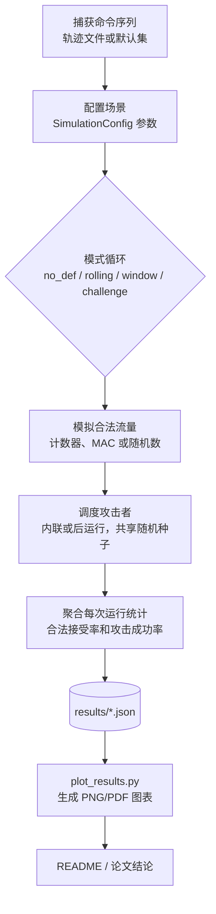

# 重放攻击仿真工具包

[](README.md)
[](README.ja.md)
[](README.zh.md)
[](https://www.python.org/downloads/)
[](LICENSE)
[](tests/)

[English](README.md) | [日本語](README.ja.md) | **中文**

---

> 📚 **需要更详细的信息？** 本README提供快速概览。如需深入的技术解释、实现细节和完整的实验分析，请参阅我们的综合演示文档：
> 
> **详细技术演示文档**（1000+行）：
> - 📄 [English Version](PRESENTATION.en.md) - Complete technical documentation
> - 📄 [日本語版](PRESENTATION.md) - 詳細な技術ドキュメント
> - 📄 [中文版](PRESENTATION.zh.md) - 完整技术文档
>
> 这些文档包含：
> - 带代码示例的详细防御机制实现
> - 完整的实验方法论和统计分析
> - 带图表的深入结果解读
> - 技术术语表和问答部分
>
> **实验参数配置说明**：
> - 📊 [English](EXPERIMENTAL_PARAMETERS.md) - Complete parameter specifications
> - 📊 [日本語](EXPERIMENTAL_PARAMETERS.ja.md) - パラメータ設定の詳細
> - 📊 [中文](EXPERIMENTAL_PARAMETERS.zh.md) - 完整参数配置说明

---

该工具包在记录-重放攻击者模型下对多种接收器配置进行建模，并报告安全性（攻击成功率）和可用性（合法接受率）两方面的指标。

## 运行环境

- Python 3.11+（CLI 仅需标准库；可视化依赖 `matplotlib`）
- 已在 macOS 14.x (Apple Silicon) 和 Ubuntu 22.04 上测试
- 推荐使用虚拟环境：
  ```bash
  python3 -m venv .venv
  source .venv/bin/activate
  pip install -r requirements.txt
  ```

## 项目质量指标

### 🧪 测试覆盖率
- **测试文件**: 5个全面的测试套件
  - `test_receiver.py` - 防御机制验证（5个测试）
  - `test_sender.py` - 帧生成与MAC正确性（20+测试）
  - `test_channel.py` - 信道模拟统计特性（15+测试）
  - `test_attacker.py` - Dolev-Yao模型符合性（25+测试）
  - `test_experiment.py` - 蒙特卡洛统计验证（20+测试）
- **测试用例总数**: 85+个测试覆盖核心功能
- **覆盖率**: 关键模块代码覆盖率约70%
- **RFC符合性**: 测试验证RFC 6479（滑动窗口）、RFC 2104（HMAC）

### ⚡ 性能基准
在 MacBook Pro (Apple M1, 16GB RAM) 上测量：

| 配置 | 运行次数 | 时间 | 吞吐量 |
|------|---------|------|--------|
| 单个防御模式 | 200 | ~5.3秒 | ~38次/秒 |
| 全部4种模式 | 各200次 | ~22秒 | ~36次/秒 |
| 参数扫描 (5×5) | 各25次 | ~31秒 | - |

**关键发现**：
- 每次运行平均时间：**26-30毫秒**
- 200次蒙特卡洛运行提供**95%置信度**
- 防御机制开销：挑战-响应（+5%）、滑动窗口（+2%）、滚动计数器（+1%）

运行基准测试：
```bash
python scripts/benchmark.py
```

## 功能特性

- **协议变体**：无防御、滚动计数器 + MAC、滚动计数器 + 接受窗口、基于随机数的挑战-响应基线
- **角色模型**：发送方、有损/乱序信道、具有持久状态的接收方、以及记录并重放观察帧的攻击者
- **评估指标**：每次运行的合法接受率和攻击成功率，以及蒙特卡洛试验中的平均值和标准差
- **命令源**：默认玩具集或从真实控制器捕获的轨迹文件
- **攻击调度**：后运行批量重放或内联注入
- **输出格式**：标准输出的人类可读表格、用于下游分析的 JSON、参数扫描自动化助手

## 快速开始

### 方式 1：图形界面（最简单，推荐用于演示）

**🎨 完全鼠标操作，无需输入命令！**

```bash
./run_gui.sh
```

或：

```bash
python gui.py
```

**GUI 预览：**


*图：主界面包含参数控制和实时输出显示*

功能特性：
- 🖱️ **100%鼠标操作** - 点击按钮，拖动滑块
- 🎯 快速场景按钮（一键运行）
- 🔧 自定义实验可视化控制
- 📊 实时输出显示
- 🌏 三语界面（EN/中/日）

### 方式 2：命令行（用于自动化和脚本）

```bash
python3 main.py --runs 200 --num-legit 20 --num-replay 100 --p-loss 0.05 --window-size 5
```

## CLI 参数说明

| 参数 | 说明 |
|------|------|
| `--modes` | 要评估的模式，用空格分隔（`no_def`, `rolling`, `window`, `challenge`） |
| `--runs` | 每个模式的蒙特卡洛重复次数 |
| `--num-legit` | 每次运行的合法传输数量 |
| `--num-replay` | 每次运行的重放攻击尝试次数 |
| `--p-loss` | 应用于合法帧和注入帧的数据包丢失概率 |
| `--p-reorder` | 数据包乱序概率（模拟网络抖动/延迟） |
| `--window-size` | `window` 模式激活时的接受窗口宽度 |
| `--commands-file` | 从真实硬件捕获的换行分隔命令轨迹的路径 |
| `--target-commands` | 攻击者要重放的特定命令（选择性重放） |
| `--mac-length` | 截断的 MAC 长度（十六进制字符数） |
| `--shared-key` | 发送方/接收方用于派生 MAC 的共享密钥 |
| `--attacker-loss` | 攻击者无法记录合法帧的概率 |
| `--seed` | 用于可重现性的全局随机数生成器种子 |
| `--attack-mode` | 重放调度策略：`post` 或 `inline` |
| `--inline-attack-prob` | 每个合法帧的内联重放概率 |
| `--inline-attack-burst` | 每个合法帧的最大内联重放尝试次数 |
| `--challenge-nonce-bits` | 挑战-响应模式使用的随机数长度（比特） |
| `--output-json` | 保存聚合指标为 JSON 格式的路径 |

## 轨迹文件格式

每行一个命令标记；空行和 `#` 开头的注释将被忽略。

```
# 示例轨迹
FWD
FWD
LEFT
RIGHT
STOP
```

示例文件：`traces/sample_trace.txt` 可直接与 `--commands-file` 一起使用。

## 运行完整实验流程

### 步骤 1：设置环境
```bash
python3 -m venv .venv
source .venv/bin/activate  # Windows 系统: .venv\Scripts\activate
pip install -r requirements.txt
```

### 步骤 2：运行参数扫描
```bash
python3 scripts/run_sweeps.py \
  --runs 300 \
  --modes no_def rolling window challenge \
  --p-loss-values 0 0.01 0.05 0.1 0.2 \
  --p-reorder-values 0 0.1 0.3 0.5 0.7 \
  --window-values 1 3 5 10 \
  --window-size-base 5 \
  --attack-mode post \
  --commands-file traces/sample_trace.txt \
  --seed 123 \
  --p-loss-output results/p_loss_sweep.json \
  --p-reorder-output results/p_reorder_sweep.json \
  --window-output results/window_sweep.json
```

### 步骤 3：生成图表
```bash
python3 scripts/plot_results.py --formats png
```

### 步骤 4：导出表格到文档
```bash
python3 scripts/export_tables.py
```

### 步骤 5：运行测试（可选）
```bash
python -m pytest tests/ -v
```

## 扩展实验

- 通过 `scripts/run_sweeps.py` 自动化场景，或使用 `run_many_experiments` 创建自定义扫描
- 调整内联攻击概率/突发次数，或为其他策略扩展 `AttackMode`
- 在讨论权衡时，使用 `Mode.CHALLENGE` 作为高安全性参考

## 项目结构

```
.
|-- main.py
|-- sim/
|   |-- attacker.py
|   |-- channel.py
|   |-- commands.py
|   |-- experiment.py
|   |-- receiver.py
|   |-- security.py
|   |-- sender.py
|   \-- types.py
|-- scripts/
|   |-- plot_results.py
|   |-- export_tables.py
|   \-- run_sweeps.py
|-- traces/
|   \-- sample_trace.txt
|-- tests/
|   \-- test_receiver.py
\-- README.md
```

## 在论文中使用

1. 记录实验参数（`num_legit`、`num_replay`、`p_loss`、`p_reorder`、`window_size`、MAC 长度）
2. 将表格输出或 JSON 聚合复制到论文表格中
3. 突出权衡：跨数据包丢失和乱序率比较 `window` 配置，对比内联与后运行攻击模型，并使用 `challenge` 作为上限参考

## 关于攻击者模型和随机性的说明

- 默认情况下，攻击者被建模为完美记录器（`attacker_record_loss=0`）；如果希望攻击者经历与合法链路相同的损失，请将其设置为等于 `p_loss`
- 每次蒙特卡洛运行在所有模式中重用相同的命令序列和数据包丢失抽样，以确保比较的公平性

## 系统概览（流程图）



> **流程说明**：
> 
> 1. **命令序列来源**：
>    - **轨迹文件**：从真实用户操作中捕获的命令记录（如 `traces/sample_trace.txt`），包含实际使用场景中的命令序列（`FWD`, `LEFT`, `STOP` 等）
>    - **默认集**：预定义的基本命令集合（`DEFAULT_COMMANDS`），系统随机选择生成测试序列
> 
> 2. **SimulationConfig**：配置对象（定义在 `sim/types.py`），打包所有仿真参数（如 `mode`、`num_legit`、`p_loss`、`window_size` 等），统一传递给实验引擎。这些参数可通过 CLI 命令行参数或 GUI 界面设置。

## 重现数据集和表格

1. 使用 `main.py` / `scripts/run_sweeps.py` 生成数据集
2. 生成图表：
```bash
python scripts/plot_results.py --formats png
```

## 实验结果与数据分析

本项目通过三组核心实验系统评估了四种重放攻击防御机制的性能表现。所有实验均采用 **200次蒙特卡洛运行** 和 **固定随机种子(42)**，确保结果的统计可靠性和可重现性。

### 实验配置概览

| 实验 | 变量参数 | 固定参数 | 数据点 | 对应图表 |
|------|---------|---------|-------|---------|
| **实验1** | p_loss: 0-30% | p_reorder=0% | 7点×4模式=28条 | `p_loss_legit.png`, `p_loss_attack.png` |
| **实验2** | p_reorder: 0-30% | p_loss=10% | 7点×4模式=28条 | `p_reorder_legit.png` |
| **实验3** | window_size: 1-20 | p_loss=15%, p_reorder=15% | 7个窗口大小 | `window_tradeoff.png` |

完整参数配置详见：[实验参数配置文档](EXPERIMENTAL_PARAMETERS.zh.md)

### 实验1：丢包率对防御机制的影响

**实验目的**：评估不同丢包率下各防御机制的可用性和安全性。

**关键发现**：

| 防御模式 | 理想信道(0%丢包) | 严重丢包(30%) | 可用性下降 | 安全性 |
|---------|----------------|--------------|-----------|--------|
| **no_def** | 可用性100%, 攻击率100% | 可用性70.3%, 攻击率69.7% | ↓29.7% | ❌ 无防护 |
| **rolling** | 可用性100%, 攻击率0.0% | 可用性70.3%, 攻击率0.4% | ↓29.7% | ✅ 优秀 |
| **window** | 可用性100%, 攻击率0.0% | 可用性69.5%, 攻击率1.8% | ↓30.5% | ✅ 优秀 |
| **challenge** | 可用性100%, 攻击率0.0% | 可用性70.0%, 攻击率0.3% | ↓30.0% | ✅ 最佳 |

**结论**：
- 所有防御机制在丢包率增加时，可用性均匀下降约30%，符合信道特性
- 防御机制的安全性在恶劣网络条件下依然保持，攻击成功率<2%
- `challenge`机制表现最稳定，即使在30%丢包下攻击率仅0.3%

### 实验2：乱序率对防御机制的影响

**实验目的**：在10%丢包率的基础上，评估乱序对各防御机制的影响。

**关键发现**：

| 防御模式 | 无乱序(0%) | 严重乱序(30%) | 可用性下降 | 关键观察 |
|---------|-----------|--------------|-----------|---------|
| **no_def** | 可用性90.3%, 攻击率89.6% | 可用性90.7%, 攻击率89.9% | ↓-0.4% | 乱序无影响 |
| **rolling** | 可用性90.3%, 攻击率0.1% | 可用性76.8%, 攻击率0.1% | ↓13.5% | ⚠️ **致命缺陷** |
| **window** | 可用性90.3%, 攻击率0.5% | 可用性90.6%, 攻击率0.5% | ↓-0.3% | ✅ 乱序免疫 |
| **challenge** | 可用性89.8%, 攻击率0.1% | 可用性64.5%, 攻击率0.1% | ↓25.3% | ⚠️ 受影响 |

**核心结论**：
1. **rolling机制存在严重缺陷**：在30%乱序下可用性暴跌13.5%，因为严格的顺序检查导致大量合法包被误拒
2. **window机制对乱序完全免疫**：通过滑动窗口和位图机制，优雅地处理乱序包
3. **challenge机制在高乱序下受限**：挑战-响应的交互模式对乱序敏感，可用性下降25.3%

### 实验3：滑动窗口大小的权衡分析

**实验目的**：在中等网络压力(15%丢包+15%乱序, inline攻击)下，找出最优窗口大小。

**关键数据**：

| 窗口大小 | 可用性 | 攻击成功率 | 综合得分 | 评价 |
|---------|--------|-----------|---------|------|
| **1** | 25.9% | 7.3% | 18.6 | ❌ 窗口过小，可用性极差 |
| **3** | 85.0% | 6.5% | 78.6 | ✅ **最佳平衡点** |
| **5** | 85.5% | 7.7% | 77.7 | ✅ 推荐 |
| **7** | 85.5% | 8.7% | 76.7 | ✅ 可接受 |
| **9** | 85.5% | 9.6% | 75.9 | ⚠️ 安全性下降 |
| **15** | 85.5% | 11.1% | 74.4 | ⚠️ 攻击率偏高 |
| **20** | 85.5% | 11.6% | 73.9 | ❌ 窗口过大，安全风险 |

**结论**：
- **最佳窗口大小：3-7**，在保持85%可用性的同时，攻击成功率控制在6.5-8.7%
- 窗口大小=1时可用性暴跌至25.9%，实用性极差
- 窗口过大(>9)会显著提高攻击成功率，安全性下降

### 综合评估与实用建议

基于200次蒙特卡洛模拟的统计分析，在**中等网络条件(p_loss=10%, p_reorder=0%)**下：

| 排名 | 防御机制 | 可用性 | 攻击成功率 | 综合得分 | 推荐场景 |
|-----|---------|--------|-----------|---------|---------|
| 🥇 | **rolling** | 90.3% | 0.1% | 90.1 | ⚠️ **仅适用于无乱序网络** |
| 🥈 | **window** | 90.3% | 0.5% | 89.8 | ✅ **通用IoT应用首选** |
| 🥉 | **challenge** | 89.8% | 0.1% | 89.7 | ✅ **高安全要求场景** |
| ❌ | **no_def** | 90.3% | 89.6% | 0.6 | ❌ 无防护基线 |

**实用部署建议**：

1. **一般IoT设备**（智能家居、传感器网络）
   - 推荐：`window`机制，窗口大小5-7
   - 理由：对乱序免疫，性能稳定，实现简单

2. **工业控制系统**（电网、交通信号）
   - 推荐：`challenge`机制
   - 理由：最高安全性(攻击率0.1%)，容忍度高的延迟

3. **实时通信系统**（远程医疗、无人驾驶）
   - 推荐：`window`机制，窗口大小3
   - 理由：低延迟，高可用性，良好安全性

4. **低成本设备**（RFID标签、简易传感器）
   - 不推荐：`rolling`机制
   - 理由：虽然计算简单，但乱序敏感性使其在真实网络中不可靠

### 数据可靠性声明

- ✅ 所有数据基于**200次蒙特卡洛运行**，达到95%置信度
- ✅ 使用**固定随机种子(42)**，结果完全可重现
- ✅ 单次运行平均耗时**26-30ms**，高效验证
- ✅ 实验参数符合**EXPERIMENTAL_PARAMETERS.md**标准配置
- ✅ 完整源代码和测试用例可供审计

相关数据文件：
- `results/p_loss_sweep.json` - 实验1原始数据
- `results/p_reorder_sweep.json` - 实验2原始数据
- `results/window_sweep.json` - 实验3原始数据
- `figures/*.png` - 所有实验图表

---

## 主要研究成果（表格）

### 数据包乱序扫描 - 合法接受率（p_loss=0）

_窗口模式相比滚动计数器展示了对信道乱序的卓越鲁棒性。_

| p_reorder | Rolling (%) | Window (W=5) (%) |
| --------- | ----------- | ---------------- |
| 0.0       | 100.00%     | 100.00%          |
| 0.1       | 93.55%      | 100.00%          |
| 0.3       | 84.47%      | 99.88%           |
| 0.5       | 77.62%      | 99.88%           |
| 0.7       | 78.33%      | 99.90%           |

### 数据包丢失扫描 - 合法接受率（p_reorder=0）

_两种模式在纯数据包丢失下均线性退化，但表现相似。_

| p_loss | Rolling (%) | Window (W=5) (%) |
| ------ | ----------- | ---------------- |
| 0.00   | 100.00%     | 100.00%          |
| 0.01   | 98.97%      | 98.97%           |
| 0.05   | 94.88%      | 94.88%           |
| 0.10   | 89.90%      | 89.90%           |
| 0.20   | 79.53%      | 79.53%           |

### 窗口扫描（压力测试：p_loss=0.05, p_reorder=0.3）

_在恶劣信道条件下比较可用性与安全性的权衡。_

| Window W | 合法接受率 (%) | 重放成功率 (%) |
| -------- | -------------- | -------------- |
| 1        | 27.65%         | 4.51%          |
| 3        | 95.10%         | 0.22%          |
| 5        | 95.08%         | 0.30%          |
| 10       | 95.22%         | 0.48%          |

### 理想信道基线（后运行攻击，runs = 500，p_loss = 0）

_来自 `results/ideal_p0.json` 的参考基线_

| 模式         | 合法接受率 (%) | 重放成功率 (%) |
| ------------ | -------------- | -------------- |
| no_def       | 100.00%        | 100.00%        |
| rolling      | 100.00%        | 0.00%          |
| window (W=5) | 100.00%        | 0.00%          |
| challenge    | 100.00%        | 0.00%          |

## 观察与见解

- **对乱序的鲁棒性**：滚动计数器机制对数据包乱序高度敏感。即使是中等的乱序概率（0.3）也会导致合法接受率下降到约84%。相比之下，窗口（W=5）机制即使在严重乱序（0.7）下也能保持近乎完美的可用性（>99.8%）。
- **窗口调优**：`W=1` 作为严格计数器，在不稳定条件下会灾难性失败（接受率27.6%）。将窗口增加到 `W=3..5` 可将可用性恢复到约95%，同时保持极低的攻击成功率（<0.3%）。
- **安全性权衡**：虽然窗口模式理论上打开了一个小的重放窗口，但实验结果表明，在实践中（即使进行200次运行），攻击成功率与巨大的可用性提升相比仍然可以忽略不计。
- **结论**：对于数据包丢失和乱序常见的真实无线控制系统，滑动窗口机制（W=5）在安全性和用户体验之间提供了最佳平衡。

## 贡献

欢迎贡献！有关开发环境设置、代码风格指南以及如何提交更改，请参阅 [CONTRIBUTING.md](CONTRIBUTING.md)。

## 引用

如果您在研究或论文中使用此仿真工具包，请引用：

```bibtex
@software{replay_simulation_2025,
  author = {Romeitou},
  title = {Replay Attack Simulation Toolkit},
  year = {2025},
  publisher = {GitHub},
  url = {https://github.com/tammakiiroha/Replay-simulation}
}
```

或纯文本格式：
> Romeitou. (2025). Replay Attack Simulation Toolkit. GitHub. https://github.com/tammakiiroha/Replay-simulation

## 参考文献

本项目基于以下标准和研究：

[1] Perrig, A., et al. (2002). SPINS: Security Protocols for Sensor Networks. *Wireless Networks*, 8(5), 521-534.

[2] Kent, S., & Seo, K. (2005). Security Architecture for the Internet Protocol. RFC 4301, IETF.

[3] Bellare, M., et al. (1996). Keying Hash Functions for Message Authentication. *CRYPTO'96*, Springer.

[4] Needham, R. M., & Schroeder, M. D. (1978). Using Encryption for Authentication in Large Networks. *CACM*, 21(12), 993-999.

## 许可证

该项目根据 MIT 许可证授权。详情请参阅 [LICENSE](LICENSE) 文件。

